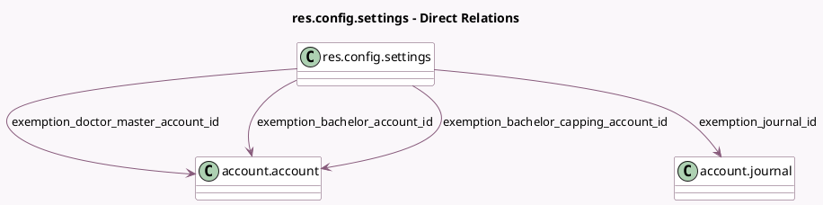

<!-- GENERATED:MODEL -->
---
tags: [odoo, enterprise, generated, model]
---

# res.config.settings

- Module: [[docs/Enterprise Addons/l10n_be_hr_payroll_account/l10n_be_hr_payroll_account|l10n_be_hr_payroll_account]]
- Scope: Enterprise Addons
- Defined in module: extension only
- Source files: `models/res_config_settings.py`
- Python classes: `ResConfigSettings`

## Field footprint

- Detected fields: 4
- Field types: `Many2one` x 4
- Relation fields: 4

## Sample fields

- `exemption_bachelor_account_id`: `Many2one` (comodel `account.account`, related `company_id.exemption_bachelor_account_id`)
- `exemption_bachelor_capping_account_id`: `Many2one` (comodel `account.account`, related `company_id.exemption_bachelor_capping_account_id`)
- `exemption_doctor_master_account_id`: `Many2one` (comodel `account.account`, related `company_id.exemption_doctor_master_account_id`)
- `exemption_journal_id`: `Many2one` (comodel `account.journal`, related `company_id.exemption_journal_id`)

## Method hints

- Detected methods: 0
- Action methods: none
- Compute methods: none
- Onchange methods: none

## Direct relation diagram

## Navigation

- **Parent:** [[docs/Enterprise Addons/l10n_be_hr_payroll_account/Models]]

<!-- GENERATED:MODEL -->
