<!-- GENERATED:MODEL -->
---
tags: [odoo, enterprise, generated, model]
---

# l10n.be.dimona.wizard

- Module: [[docs/Enterprise Addons/l10n_be_hr_payroll_dimona/l10n_be_hr_payroll_dimona|l10n_be_hr_payroll_dimona]]
- Scope: Enterprise Addons
- Defined in module: yes
- Source files: `wizard/l10n_be_dimona_wizard.py`
- Python classes: `L10nBeDimonaWizard`
- Description: Dimona Wizard

## Field footprint

- Detected fields: 11
- Field types: `Boolean` x 2, `Char` x 1, `Date` x 3, `Integer` x 1, `Many2one` x 2, `Selection` x 2
- Relation fields: 2

## Sample fields

- `contract_country_code`: `Char` (related `version_id.country_code`)
- `contract_date_end`: `Date` (related `version_id.contract_date_end`)
- `contract_date_start`: `Date` (related `version_id.contract_date_start`)
- `contract_is_student`: `Boolean` (related `version_id.l10n_be_is_student`)
- `contract_planned_hours`: `Integer` (related `version_id.l10n_be_dimona_planned_hours`)
- `contract_wage_type`: `Selection` (related `version_id.wage_type`)
- `declaration_type`: `Selection`
- `employee_birthday`: `Date` (related `employee_id.birthday`)
- `employee_id`: `Many2one` (comodel `hr.employee`)
- `version_id`: `Many2one` (comodel `hr.version`, compute `_compute_version_id`, store `True`)
- `without_niss`: `Boolean`

## Method hints

- Detected methods: 3
- Action methods: none
- Compute methods: `_compute_version_id`
- Onchange methods: none

## Direct relation diagram

```plantuml
@startuml
!define ODOO_COLOR_PRIMARY #714B67
!define ODOO_COLOR_ACCENT #875A7B
!define ODOO_COLOR_BG #FAF7FA

skinparam backgroundColor ODOO_COLOR_BG
skinparam defaultTextAlignment left
skinparam ArrowColor ODOO_COLOR_ACCENT
skinparam ClassBackgroundColor white
skinparam ClassBorderColor ODOO_COLOR_PRIMARY
skinparam ComponentBackgroundColor white
skinparam ComponentBorderColor ODOO_COLOR_PRIMARY
skinparam NoteBackgroundColor #FFF8FF
skinparam NoteBorderColor ODOO_COLOR_ACCENT
skinparam SequenceLifeLineBorderColor ODOO_COLOR_ACCENT
skinparam SequenceLifeLineBackgroundColor #FFFFFF
skinparam SequenceParticipantBorderColor ODOO_COLOR_PRIMARY
skinparam SequenceParticipantBackgroundColor #FFFFFF
skinparam sequence {
  ArrowColor ODOO_COLOR_ACCENT
  ActorBorderColor ODOO_COLOR_PRIMARY
}
title l10n.be.dimona.wizard - Direct Relations
class "l10n.be.dimona.wizard" as l10n_be_dimona_wizard
class "hr.employee" as hr_employee
class "hr.version" as hr_version
l10n_be_dimona_wizard --> hr_version : version_id
l10n_be_dimona_wizard --> hr_employee : employee_id
@enduml
```

## Navigation

- **Parent:** [[docs/Enterprise Addons/l10n_be_hr_payroll_dimona/Models]]

<!-- GENERATED:MODEL -->
