<!-- GENERATED:MODEL -->
---
tags: [odoo, enterprise, generated, model]
---

# hr.employee

- Module: [[docs/Enterprise Addons/l10n_be_hr_payroll_dimona_auto/l10n_be_hr_payroll_dimona_auto|l10n_be_hr_payroll_dimona_auto]]
- Scope: Enterprise Addons
- Defined in module: extension only
- Source files: `models/hr_employee.py`
- Python classes: `HrEmployee`

## Field footprint

- Detected fields: 8
- Field types: `Boolean` x 4, `Many2one` x 3, `Selection` x 1
- Relation fields: 3

## Sample fields

- `l10n_be_dimona_declaration_id`: `Many2one` (related `version_id.l10n_be_dimona_declaration_id`)
- `l10n_be_dimona_next_action`: `Selection` (related `version_id.l10n_be_dimona_next_action`)
- `l10n_be_dimona_relation_id`: `Many2one` (comodel `l10n.be.dimona.relation`)
- `l10n_be_last_dimona_declaration_id`: `Many2one` (related `version_id.l10n_be_last_dimona_declaration_id`)
- `l10n_be_needs_dimona_cancel`: `Boolean` (related `version_id.l10n_be_needs_dimona_cancel`)
- `l10n_be_needs_dimona_in`: `Boolean` (related `version_id.l10n_be_needs_dimona_in`)
- `l10n_be_needs_dimona_out`: `Boolean` (related `version_id.l10n_be_needs_dimona_out`)
- `l10n_be_needs_dimona_update`: `Boolean` (related `version_id.l10n_be_needs_dimona_update`)

## Method hints

- Detected methods: 6
- Action methods: `action_cancel_dimona`, `action_close_dimona`, `action_open_dimona`, `action_open_relation`, `action_update_dimona`
- Compute methods: none
- Onchange methods: none

## Direct relation diagram

```plantuml
@startuml
!define ODOO_COLOR_PRIMARY #714B67
!define ODOO_COLOR_ACCENT #875A7B
!define ODOO_COLOR_BG #FAF7FA

skinparam backgroundColor ODOO_COLOR_BG
skinparam defaultTextAlignment left
skinparam ArrowColor ODOO_COLOR_ACCENT
skinparam ClassBackgroundColor white
skinparam ClassBorderColor ODOO_COLOR_PRIMARY
skinparam ComponentBackgroundColor white
skinparam ComponentBorderColor ODOO_COLOR_PRIMARY
skinparam NoteBackgroundColor #FFF8FF
skinparam NoteBorderColor ODOO_COLOR_ACCENT
skinparam SequenceLifeLineBorderColor ODOO_COLOR_ACCENT
skinparam SequenceLifeLineBackgroundColor #FFFFFF
skinparam SequenceParticipantBorderColor ODOO_COLOR_PRIMARY
skinparam SequenceParticipantBackgroundColor #FFFFFF
skinparam sequence {
  ArrowColor ODOO_COLOR_ACCENT
  ActorBorderColor ODOO_COLOR_PRIMARY
}
title hr.employee - Direct Relations
class "hr.employee" as hr_employee
class "l10n.be.dimona.relation" as l10n_be_dimona_relation
hr_employee --> l10n_be_dimona_relation : l10n_be_dimona_relation_id
@enduml
```

## Navigation

- **Parent:** [[docs/Enterprise Addons/l10n_be_hr_payroll_dimona_auto/Models]]

<!-- GENERATED:MODEL -->
