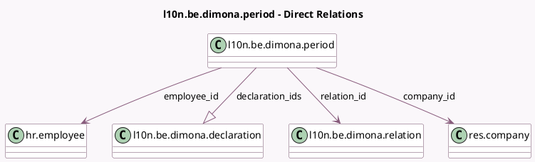

<!-- GENERATED:MODEL -->
---
tags: [odoo, enterprise, generated, model]
---

# l10n.be.dimona.period

- Module: [[docs/Enterprise Addons/l10n_be_hr_payroll_dimona_auto/l10n_be_hr_payroll_dimona_auto|l10n_be_hr_payroll_dimona_auto]]
- Scope: Enterprise Addons
- Defined in module: yes
- Source files: `models/l10n_be_dimona_period.py`
- Python classes: `L10nBeDimonaPeriod`
- Description: Dimona Period

## Field footprint

- Detected fields: 9
- Field types: `Char` x 1, `Date` x 2, `Integer` x 1, `Json` x 1, `Many2one` x 3, `One2many` x 1
- Relation fields: 4

## Sample fields

- `company_id`: `Many2one` (comodel `res.company`)
- `content`: `Json`
- `date_end`: `Date` (compute `_compute_period_info`, store `True`)
- `date_start`: `Date` (compute `_compute_period_info`, store `True`)
- `declaration_count`: `Integer` (compute `_compute_declaration_count`)
- `declaration_ids`: `One2many` (comodel `l10n.be.dimona.declaration`)
- `employee_id`: `Many2one` (comodel `hr.employee`, compute `_compute_period_info`, store `True`)
- `name`: `Char` (comodel `Period ID`)
- `relation_id`: `Many2one` (comodel `l10n.be.dimona.relation`, compute `_compute_period_info`, store `True`)

## Method hints

- Detected methods: 3
- Action methods: `action_open_declarations`
- Compute methods: `_compute_declaration_count`, `_compute_period_info`
- Onchange methods: none

## Direct relation diagram

## Navigation

- **Parent:** [[docs/Enterprise Addons/l10n_be_hr_payroll_dimona_auto/Models]]

<!-- GENERATED:MODEL -->
