<!-- GENERATED:MODEL -->
---
tags: [odoo, enterprise, generated, model]
---

# l10n.be.dimona.relation

- Module: [[docs/Enterprise Addons/l10n_be_hr_payroll_dimona_auto/l10n_be_hr_payroll_dimona_auto|l10n_be_hr_payroll_dimona_auto]]
- Scope: Enterprise Addons
- Defined in module: yes
- Source files: `models/l10n_be_dimona_relation.py`
- Python classes: `L10nBeDimonaRelation`
- Description: Dimona Relation

## Field footprint

- Detected fields: 8
- Field types: `Char` x 1, `Date` x 2, `Integer` x 1, `Json` x 1, `Many2one` x 2, `One2many` x 1
- Relation fields: 3

## Sample fields

- `company_id`: `Many2one` (comodel `res.company`)
- `content`: `Json`
- `date_end`: `Date` (compute `_compute_relation_info`, store `True`)
- `date_start`: `Date` (compute `_compute_relation_info`, store `True`)
- `employee_id`: `Many2one` (comodel `hr.employee`, compute `_compute_relation_info`, store `True`)
- `name`: `Char` (comodel `NISS`)
- `period_count`: `Integer` (compute `_compute_period_count`)
- `period_ids`: `One2many` (comodel `l10n.be.dimona.period`)

## Method hints

- Detected methods: 3
- Action methods: `action_open_periods`
- Compute methods: `_compute_period_count`, `_compute_relation_info`
- Onchange methods: none

## Direct relation diagram

```plantuml
@startuml
!define ODOO_COLOR_PRIMARY #714B67
!define ODOO_COLOR_ACCENT #875A7B
!define ODOO_COLOR_BG #FAF7FA

skinparam backgroundColor ODOO_COLOR_BG
skinparam defaultTextAlignment left
skinparam ArrowColor ODOO_COLOR_ACCENT
skinparam ClassBackgroundColor white
skinparam ClassBorderColor ODOO_COLOR_PRIMARY
skinparam ComponentBackgroundColor white
skinparam ComponentBorderColor ODOO_COLOR_PRIMARY
skinparam NoteBackgroundColor #FFF8FF
skinparam NoteBorderColor ODOO_COLOR_ACCENT
skinparam SequenceLifeLineBorderColor ODOO_COLOR_ACCENT
skinparam SequenceLifeLineBackgroundColor #FFFFFF
skinparam SequenceParticipantBorderColor ODOO_COLOR_PRIMARY
skinparam SequenceParticipantBackgroundColor #FFFFFF
skinparam sequence {
  ArrowColor ODOO_COLOR_ACCENT
  ActorBorderColor ODOO_COLOR_PRIMARY
}
title l10n.be.dimona.relation - Direct Relations
class "l10n.be.dimona.relation" as l10n_be_dimona_relation
class "hr.employee" as hr_employee
class "l10n.be.dimona.period" as l10n_be_dimona_period
class "res.company" as res_company
l10n_be_dimona_relation --> res_company : company_id
l10n_be_dimona_relation --|> l10n_be_dimona_period : period_ids
l10n_be_dimona_relation --> hr_employee : employee_id
@enduml
```

## Navigation

- **Parent:** [[docs/Enterprise Addons/l10n_be_hr_payroll_dimona_auto/Models]]

<!-- GENERATED:MODEL -->
