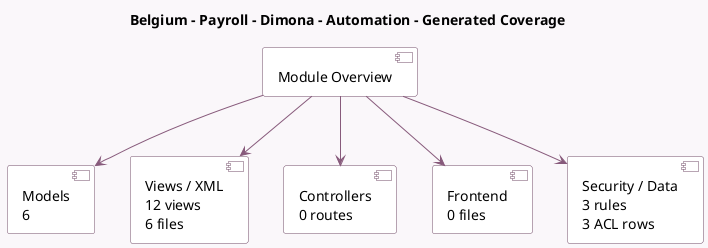

<!-- GENERATED:MODULE -->
---
tags: [odoo, enterprise, module]
---

# Belgium - Payroll - Dimona - Automation

- Scope: Enterprise Addons
- Source: enterprise/l10n_be_hr_payroll_dimona_auto
- Dependencies: [[docs/Enterprise Addons/l10n_be_hr_payroll_dimona/l10n_be_hr_payroll_dimona|l10n_be_hr_payroll_dimona]], [[docs/Enterprise Addons/l10n_be_hr_payroll/l10n_be_hr_payroll|l10n_be_hr_payroll]]

## Generated coverage

- Models: 6
- XML files with UI/data artifacts: 6
- Views: 12
- Actions: 10
- Menus: 3
- Rules (ir.rule): 3
- Access CSV entries: 3
- Controller units: 0
- Frontend asset files: 0

## Module map

## Detail notes

- Models: [[docs/Enterprise Addons/l10n_be_hr_payroll_dimona_auto/Models|Models]] (6)
- Views and XML: [[docs/Enterprise Addons/l10n_be_hr_payroll_dimona_auto/Views|Views]] (6 files)

## Key models

- `hr.employee`
- `hr.version`
- `l10n.be.dimona.declaration`
- `l10n.be.dimona.period`
- `l10n.be.dimona.relation`
- `l10n.be.dimona.wizard`

## Navigation

- [[../Enterprise Addons/Enterprise Addons|Back to scope]]
- [[../../docs/docs|Back to docs]]

<!-- GENERATED:MODULE -->

