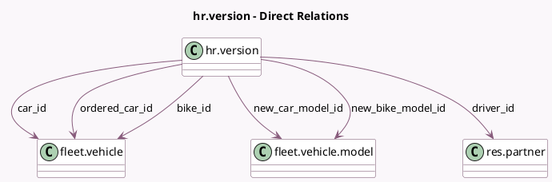

<!-- GENERATED:MODEL -->
---
tags: [odoo, enterprise, generated, model]
---

# hr.version

- Module: [[docs/Enterprise Addons/l10n_be_hr_payroll_fleet/l10n_be_hr_payroll_fleet|l10n_be_hr_payroll_fleet]]
- Scope: Enterprise Addons
- Defined in module: extension only
- Source files: `models/hr_version.py`
- Python classes: `HrVersion`

## Field footprint

- Detected fields: 23
- Field types: `Boolean` x 4, `Char` x 1, `Date` x 1, `Float` x 7, `Integer` x 3, `Many2one` x 6, `Selection` x 1
- Relation fields: 6

## Sample fields

- `acquisition_date`: `Date` (related `car_id.acquisition_date`)
- `available_cars_amount`: `Integer` (compute `_compute_available_cars_amount`)
- `bike_id`: `Many2one` (comodel `fleet.vehicle`, compute `_compute_bike_id`, store `True`)
- `car_atn`: `Float` (compute `_compute_car_atn_and_costs`, store `True`)
- `car_id`: `Many2one` (comodel `fleet.vehicle`, compute `_compute_car_id`, store `True`)
- `car_model_name`: `Char` (compute `_compute_car_model_name`)
- `car_open_contracts_count`: `Integer` (compute `_compute_car_open_contracts_count`)
- `car_value`: `Float` (related `car_id.car_value`)
- `co2`: `Float` (related `car_id.co2`)
- `company_bike_depreciated_cost`: `Float` (compute `_compute_company_bike_depreciated_cost`, store `True`)
- `company_car_total_depreciated_cost`: `Float` (compute `_compute_car_atn_and_costs`, store `True`)
- `driver_id`: `Many2one` (comodel `res.partner`, related `car_id.driver_id`)
- `fuel_type`: `Selection` (compute `_compute_fuel_type`)
- `max_unused_cars`: `Integer` (compute `_compute_max_unused_cars`)
- `new_bike`: `Boolean` (comodel `Requested a new bike`, compute `_compute_new_bike`, store `True`)
- `new_bike_model_id`: `Many2one` (comodel `fleet.vehicle.model`, compute `_compute_new_bike_model_id`, store `True`)
- `new_car`: `Boolean` (comodel `Requested a new car`)
- `new_car_model_id`: `Many2one` (comodel `fleet.vehicle.model`)
- `ordered_car_id`: `Many2one` (comodel `fleet.vehicle`, store `True`)
- `recurring_cost_amount_depreciated`: `Float` (compute `_compute_recurring_cost_amount_depreciated`)

## Method hints

- Detected methods: 22
- Action methods: none
- Compute methods: `_compute_available_cars_amount`, `_compute_bike_id`, `_compute_car_atn_and_costs`, `_compute_car_id`, `_compute_car_model_name`, `_compute_car_open_contracts_count`, `_compute_company_bike_depreciated_cost`, `_compute_fuel_type`, and 4 more
- Onchange methods: `_onchange_has_bicycle`, `_onchange_new_bike`, `_onchange_transport_mode`

## Direct relation diagram

## Navigation

- **Parent:** [[docs/Enterprise Addons/l10n_be_hr_payroll_fleet/Models]]

<!-- GENERATED:MODEL -->
