<!-- GENERATED:MODEL -->
---
tags: [odoo, enterprise, generated, model]
---

# l10n_be.dmfa

- Module: [[docs/Enterprise Addons/l10n_be_hr_payroll_fleet/l10n_be_hr_payroll_fleet|l10n_be_hr_payroll_fleet]]
- Scope: Enterprise Addons
- Defined in module: extension only
- Source files: `models/hr_dmfa.py`
- Python classes: `L10n_BeDmfa`

## Field footprint

- Detected fields: 1
- Field types: `One2many` x 1
- Relation fields: 1

## Sample fields

- `vehicle_ids`: `One2many` (comodel `fleet.vehicle`, compute `_compute_vehicle_ids`)

## Method hints

- Detected methods: 4
- Action methods: none
- Compute methods: `_compute_vehicle_ids`
- Onchange methods: none

## Direct relation diagram

```plantuml
@startuml
!define ODOO_COLOR_PRIMARY #714B67
!define ODOO_COLOR_ACCENT #875A7B
!define ODOO_COLOR_BG #FAF7FA

skinparam backgroundColor ODOO_COLOR_BG
skinparam defaultTextAlignment left
skinparam ArrowColor ODOO_COLOR_ACCENT
skinparam ClassBackgroundColor white
skinparam ClassBorderColor ODOO_COLOR_PRIMARY
skinparam ComponentBackgroundColor white
skinparam ComponentBorderColor ODOO_COLOR_PRIMARY
skinparam NoteBackgroundColor #FFF8FF
skinparam NoteBorderColor ODOO_COLOR_ACCENT
skinparam SequenceLifeLineBorderColor ODOO_COLOR_ACCENT
skinparam SequenceLifeLineBackgroundColor #FFFFFF
skinparam SequenceParticipantBorderColor ODOO_COLOR_PRIMARY
skinparam SequenceParticipantBackgroundColor #FFFFFF
skinparam sequence {
  ArrowColor ODOO_COLOR_ACCENT
  ActorBorderColor ODOO_COLOR_PRIMARY
}
title l10n_be.dmfa - Direct Relations
class "l10n_be.dmfa" as l10n_be_dmfa
class "fleet.vehicle" as fleet_vehicle
l10n_be_dmfa --|> fleet_vehicle : vehicle_ids
@enduml
```

## Navigation

- **Parent:** [[docs/Enterprise Addons/l10n_be_hr_payroll_fleet/Models]]

<!-- GENERATED:MODEL -->
