<!-- GENERATED:MODEL -->
---
tags: [odoo, enterprise, generated, model]
---

# l10n.be.hr.payroll.export.prisma

- Module: [[docs/Enterprise Addons/l10n_be_hr_payroll_prisma/l10n_be_hr_payroll_prisma|l10n_be_hr_payroll_prisma]]
- Scope: Enterprise Addons
- Defined in module: yes
- Source files: `models/hr_payroll_export_prisma.py`
- Python classes: `L10nBeHrPayrollExportPrisma`
- Description: Export Payroll to Prisma
- Inherits: `hr.work.entry.export.mixin`

## Field footprint

- Detected fields: 1
- Field types: `One2many` x 1
- Relation fields: 1

## Sample fields

- `eligible_employee_line_ids`: `One2many` (comodel `l10n.be.hr.payroll.export.prisma.employee`)

## Method hints

- Detected methods: 5
- Action methods: none
- Compute methods: none
- Onchange methods: none

## Direct relation diagram

```plantuml
@startuml
!define ODOO_COLOR_PRIMARY #714B67
!define ODOO_COLOR_ACCENT #875A7B
!define ODOO_COLOR_BG #FAF7FA

skinparam backgroundColor ODOO_COLOR_BG
skinparam defaultTextAlignment left
skinparam ArrowColor ODOO_COLOR_ACCENT
skinparam ClassBackgroundColor white
skinparam ClassBorderColor ODOO_COLOR_PRIMARY
skinparam ComponentBackgroundColor white
skinparam ComponentBorderColor ODOO_COLOR_PRIMARY
skinparam NoteBackgroundColor #FFF8FF
skinparam NoteBorderColor ODOO_COLOR_ACCENT
skinparam SequenceLifeLineBorderColor ODOO_COLOR_ACCENT
skinparam SequenceLifeLineBackgroundColor #FFFFFF
skinparam SequenceParticipantBorderColor ODOO_COLOR_PRIMARY
skinparam SequenceParticipantBackgroundColor #FFFFFF
skinparam sequence {
  ArrowColor ODOO_COLOR_ACCENT
  ActorBorderColor ODOO_COLOR_PRIMARY
}
title l10n.be.hr.payroll.export.prisma - Direct Relations
class "l10n.be.hr.payroll.export.prisma" as l10n_be_hr_payroll_export_prisma
class "l10n.be.hr.payroll.export.prisma.employee" as l10n_be_hr_payroll_export_prisma_employee
l10n_be_hr_payroll_export_prisma --|> l10n_be_hr_payroll_export_prisma_employee : eligible_employee_line_ids
@enduml
```

## Navigation

- **Parent:** [[docs/Enterprise Addons/l10n_be_hr_payroll_prisma/Models]]

<!-- GENERATED:MODEL -->
