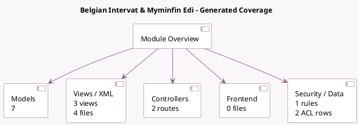

<!-- GENERATED:MODULE -->
---
tags: [odoo, enterprise, module]
---

# Belgian Intervat & Myminfin Edi

- Scope: Enterprise Addons
- Source: enterprise/l10n_be_intervat
- Dependencies: [[docs/Community Addons/l10n_be/l10n_be|l10n_be]], [[docs/Enterprise Addons/l10n_be_reports/l10n_be_reports|l10n_be_reports]], [[docs/Community Addons/certificate/certificate|certificate]]

## Generated coverage

- Models: 7
- XML files with UI/data artifacts: 4
- Views: 3
- Actions: 0
- Menus: 0
- Rules (ir.rule): 1
- Access CSV entries: 2
- Controller units: 1
- Frontend asset files: 0

## Module map

## Detail notes

- Models: [[docs/Enterprise Addons/l10n_be_intervat/Models|Models]] (7)
- Views and XML: [[docs/Enterprise Addons/l10n_be_intervat/Views|Views]] (4 files)
- Controllers: [[docs/Enterprise Addons/l10n_be_intervat/Controllers|Controllers]] (1)

## Key models

- `account.return`
- `certificate.certificate`
- `l10n_be.tax.report.handler`
- `l10n_be.vat.declaration`
- `l10n_be_reports.vat.return.lock.wizard`
- `res.company`
- `res.config.settings`

## Navigation

- [[../Enterprise Addons/Enterprise Addons|Back to scope]]
- [[../../docs/docs|Back to docs]]

<!-- GENERATED:MODULE -->

