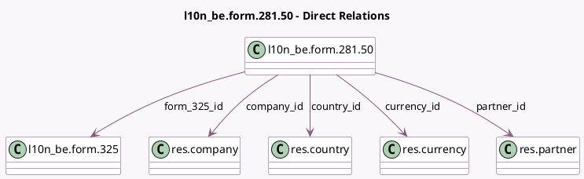

<!-- GENERATED:MODEL -->
---
tags: [odoo, enterprise, generated, model]
---

# l10n_be.form.281.50

- Module: [[docs/Enterprise Addons/l10n_be_reports/l10n_be_reports|l10n_be_reports]]
- Scope: Enterprise Addons
- Defined in module: yes
- Source files: `models/account_281_50_form.py`
- Python classes: `L10n_BeForm28150`
- Description: Represents a 281.50 form
- Inherits: `mail.thread`

## Field footprint

- Detected fields: 27
- Field types: `Boolean` x 1, `Char` x 11, `Many2one` x 5, `Monetary` x 8, `Selection` x 2
- Relation fields: 5

## Sample fields

- `atn`: `Monetary`
- `commissions`: `Monetary`
- `company_id`: `Many2one` (comodel `res.company`, related `form_325_id.company_id`)
- `country_id`: `Many2one` (comodel `res.country`, compute `_compute_country_id`, store `True`)
- `currency_id`: `Many2one` (comodel `res.currency`, related `form_325_id.currency_id`)
- `exposed_expenses`: `Monetary`
- `fees`: `Monetary`
- `form_325_id`: `Many2one` (comodel `l10n_be.form.325`)
- `income_debtor_bce_number`: `Char` (related `form_325_id.debtor_bce_number`)
- `official_id`: `Char`
- `paid_amount`: `Monetary`
- `partner_address`: `Char` (compute `_compute_partner_address`, store `True`)
- `partner_bce_number`: `Char` (compute `_compute_partner_bce_number`, store `True`)
- `partner_citizen_identification`: `Char` (compute `_compute_partner_citizen_identification`, store `True`)
- `partner_city`: `Char` (compute `_compute_partner_city`, store `True`)
- `partner_first_name`: `Char` (compute `_compute_partner_names`, store `True`)
- `partner_id`: `Many2one` (comodel `res.partner`)
- `partner_is_natural_person`: `Boolean` (compute `_compute_partner_is_natural_person`, store `True`)
- `partner_job_position`: `Char`
- `partner_name`: `Char` (compute `_compute_partner_names`, store `True`)

## Method hints

- Detected methods: 20
- Action methods: `action_download_281_50_individual_pdf`, `action_open_281_50_view_form`
- Compute methods: `_compute_country_id`, `_compute_display_name`, `_compute_partner_address`, `_compute_partner_bce_number`, `_compute_partner_citizen_identification`, `_compute_partner_city`, `_compute_partner_country`, `_compute_partner_is_natural_person`, and 3 more
- Onchange methods: none

## Direct relation diagram

## Navigation

- **Parent:** [[docs/Enterprise Addons/l10n_be_reports/Models]]

<!-- GENERATED:MODEL -->
