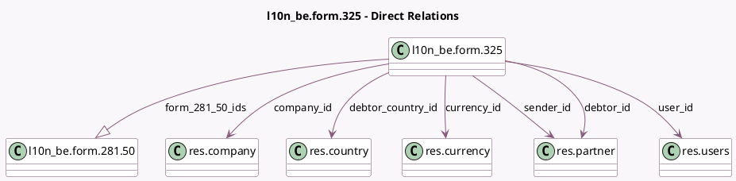

<!-- GENERATED:MODEL -->
---
tags: [odoo, enterprise, generated, model]
---

# l10n_be.form.325

- Module: [[docs/Enterprise Addons/l10n_be_reports/l10n_be_reports|l10n_be_reports]]
- Scope: Enterprise Addons
- Defined in module: yes
- Source files: `models/account_325_form.py`
- Python classes: `L10n_BeForm325`
- Description: Represents a 325 form
- Inherits: `mail.thread`

## Field footprint

- Detected fields: 29
- Field types: `Boolean` x 1, `Char` x 15, `Integer` x 1, `Many2one` x 6, `Monetary` x 1, `One2many` x 1, `Selection` x 4
- Relation fields: 7

## Sample fields

- `company_id`: `Many2one` (comodel `res.company`)
- `currency_id`: `Many2one` (comodel `res.currency`, related `company_id.currency_id`)
- `debtor_address`: `Char` (compute `_compute_debtor_address`, store `True`)
- `debtor_bce_number`: `Char` (compute `_compute_debtor_bce_number`, store `True`)
- `debtor_citizen_identification`: `Char` (compute `_compute_debtor_citizen_identification`, store `True`)
- `debtor_city`: `Char` (compute `_compute_debtor_city`, store `True`)
- `debtor_country_id`: `Many2one` (comodel `res.country`, compute `_compute_debtor_country_id`, store `True`)
- `debtor_id`: `Many2one` (comodel `res.partner`, related `company_id.partner_id`, store `True`)
- `debtor_is_natural_person`: `Char` (compute `_compute_debtor_is_natural_person`, store `True`)
- `debtor_name`: `Char` (compute `_compute_debtor_name`, store `True`)
- `debtor_phone_number`: `Char` (compute `_compute_debtor_phone_number`, store `True`)
- `debtor_zip`: `Char` (compute `_compute_debtor_zip`, store `True`)
- `form_281_50_count`: `Integer` (compute `_compute_form_281_50_count`)
- `form_281_50_ids`: `One2many` (comodel `l10n_be.form.281.50`)
- `form_281_50_total_amount`: `Monetary` (compute `_compute_form_281_50_total_amount`)
- `is_test`: `Boolean`
- `reference_year`: `Char`
- `sender_address`: `Char` (compute `_compute_sender_address`, store `True`)
- `sender_bce_number`: `Char` (compute `_compute_sender_bce_number`, store `True`)
- `sender_city`: `Char` (compute `_compute_sender_city`, store `True`)

## Method hints

- Detected methods: 36
- Action methods: `action_generate_281_50_form_file`, `action_generate_281_50_form_pdf`, `action_generate_281_50_form_xml`, `action_generate_325_form_pdf`
- Compute methods: `_compute_debtor_address`, `_compute_debtor_bce_number`, `_compute_debtor_citizen_identification`, `_compute_debtor_city`, `_compute_debtor_country_id`, `_compute_debtor_is_natural_person`, `_compute_debtor_name`, `_compute_debtor_phone_number`, and 11 more
- Onchange methods: none

## Direct relation diagram

## Navigation

- **Parent:** [[docs/Enterprise Addons/l10n_be_reports/Models]]

<!-- GENERATED:MODEL -->
