<!-- GENERATED:MODEL -->
---
tags: [odoo, enterprise, generated, model]
---

# l10n_be.form.325.wizard

- Module: [[docs/Enterprise Addons/l10n_be_reports/l10n_be_reports|l10n_be_reports]]
- Scope: Enterprise Addons
- Defined in module: yes
- Source files: `wizard/l10n_be_325_form_wizard.py`
- Python classes: `L10n_BeForm325Wizard`
- Description: 325 Form Wizard

## Field footprint

- Detected fields: 6
- Field types: `Boolean` x 1, `Char` x 1, `Many2one` x 2, `Selection` x 2
- Relation fields: 2

## Sample fields

- `company_id`: `Many2one` (comodel `res.company`)
- `is_test`: `Boolean`
- `reference_year`: `Char`
- `sender_id`: `Many2one` (comodel `res.partner`, compute `_compute_sender_id`, store `True`)
- `sending_type`: `Selection`
- `treatment_type`: `Selection`

## Method hints

- Detected methods: 4
- Action methods: `action_generate_325_form`
- Compute methods: `_compute_sender_id`
- Onchange methods: none

## Direct relation diagram

```plantuml
@startuml
!define ODOO_COLOR_PRIMARY #714B67
!define ODOO_COLOR_ACCENT #875A7B
!define ODOO_COLOR_BG #FAF7FA

skinparam backgroundColor ODOO_COLOR_BG
skinparam defaultTextAlignment left
skinparam ArrowColor ODOO_COLOR_ACCENT
skinparam ClassBackgroundColor white
skinparam ClassBorderColor ODOO_COLOR_PRIMARY
skinparam ComponentBackgroundColor white
skinparam ComponentBorderColor ODOO_COLOR_PRIMARY
skinparam NoteBackgroundColor #FFF8FF
skinparam NoteBorderColor ODOO_COLOR_ACCENT
skinparam SequenceLifeLineBorderColor ODOO_COLOR_ACCENT
skinparam SequenceLifeLineBackgroundColor #FFFFFF
skinparam SequenceParticipantBorderColor ODOO_COLOR_PRIMARY
skinparam SequenceParticipantBackgroundColor #FFFFFF
skinparam sequence {
  ArrowColor ODOO_COLOR_ACCENT
  ActorBorderColor ODOO_COLOR_PRIMARY
}
title l10n_be.form.325.wizard - Direct Relations
class "l10n_be.form.325.wizard" as l10n_be_form_325_wizard
class "res.company" as res_company
class "res.partner" as res_partner
l10n_be_form_325_wizard --> res_company : company_id
l10n_be_form_325_wizard --> res_partner : sender_id
@enduml
```

## Navigation

- **Parent:** [[docs/Enterprise Addons/l10n_be_reports/Models]]

<!-- GENERATED:MODEL -->
