<!-- GENERATED:MODEL -->
---
tags: [odoo, enterprise, generated, model]
---

# l10n_be_reports.vat.return.lock.wizard

- Module: [[docs/Enterprise Addons/l10n_be_reports/l10n_be_reports|l10n_be_reports]]
- Scope: Enterprise Addons
- Defined in module: yes
- Source files: `wizard/vat_return_lock_wizard.py`
- Python classes: `L10n_BeVatReturnLockWizard`
- Description: Belgian Periodic VAT Report Lock Wizard

## Field footprint

- Detected fields: 15
- Field types: `Boolean` x 4, `Char` x 1, `Float` x 8, `Integer` x 1, `Many2one` x 1
- Relation fields: 1

## Sample fields

- `ask_restitution`: `Boolean`
- `is_prorata_necessary`: `Boolean`
- `prorata`: `Integer` (comodel `Definitive Prorata`)
- `prorata_at_0`: `Float` (comodel `Actual Use at 0%`)
- `prorata_at_100`: `Float` (comodel `Actual Use at 100%`)
- `prorata_year`: `Char` (compute `_compute_prorata_year`)
- `return_id`: `Many2one` (comodel `account.return`)
- `show_prorata`: `Boolean` (compute `_compute_show_prorata`)
- `special_prorata_1`: `Float` (comodel `Special Prorata 1`)
- `special_prorata_2`: `Float` (comodel `Special Prorata 2`)
- `special_prorata_3`: `Float` (comodel `Special Prorata 3`)
- `special_prorata_4`: `Float` (comodel `Special Prorata 4`)
- `special_prorata_5`: `Float` (comodel `Special Prorata 5`)
- `special_prorata_deduction`: `Float` (comodel `Special Prorata Deduction %`)
- `submit_more`: `Boolean` (comodel `I want to submit more than 5 specific prorata`)

## Method hints

- Detected methods: 4
- Action methods: `action_proceed_with_locking`
- Compute methods: `_compute_prorata_year`, `_compute_show_prorata`
- Onchange methods: none

## Direct relation diagram

```plantuml
@startuml
!define ODOO_COLOR_PRIMARY #714B67
!define ODOO_COLOR_ACCENT #875A7B
!define ODOO_COLOR_BG #FAF7FA

skinparam backgroundColor ODOO_COLOR_BG
skinparam defaultTextAlignment left
skinparam ArrowColor ODOO_COLOR_ACCENT
skinparam ClassBackgroundColor white
skinparam ClassBorderColor ODOO_COLOR_PRIMARY
skinparam ComponentBackgroundColor white
skinparam ComponentBorderColor ODOO_COLOR_PRIMARY
skinparam NoteBackgroundColor #FFF8FF
skinparam NoteBorderColor ODOO_COLOR_ACCENT
skinparam SequenceLifeLineBorderColor ODOO_COLOR_ACCENT
skinparam SequenceLifeLineBackgroundColor #FFFFFF
skinparam SequenceParticipantBorderColor ODOO_COLOR_PRIMARY
skinparam SequenceParticipantBackgroundColor #FFFFFF
skinparam sequence {
  ArrowColor ODOO_COLOR_ACCENT
  ActorBorderColor ODOO_COLOR_PRIMARY
}
title l10n_be_reports.vat.return.lock.wizard - Direct Relations
class "l10n_be_reports.vat.return.lock.wizard" as l10n_be_reports_vat_return_lock_wizard
class "account.return" as account_return
l10n_be_reports_vat_return_lock_wizard --> account_return : return_id
@enduml
```

## Navigation

- **Parent:** [[docs/Enterprise Addons/l10n_be_reports/Models]]

<!-- GENERATED:MODEL -->
