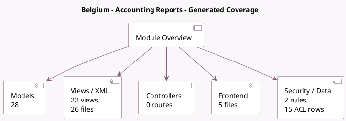

<!-- GENERATED:MODULE -->
---
tags: [odoo, enterprise, module]
---

# Belgium - Accounting Reports

- Scope: Enterprise Addons
- Source: enterprise/l10n_be_reports
- Dependencies: [[docs/Community Addons/l10n_be/l10n_be|l10n_be]], [[docs/Enterprise Addons/account_reports/account_reports|account_reports]]

## Generated coverage

- Models: 28
- XML files with UI/data artifacts: 26
- Views: 22
- Actions: 13
- Menus: 4
- Rules (ir.rule): 2
- Access CSV entries: 15
- Controller units: 0
- Frontend asset files: 5

## Module map

## Detail notes

- Models: [[docs/Enterprise Addons/l10n_be_reports/Models|Models]] (28)
- Views and XML: [[docs/Enterprise Addons/l10n_be_reports/Views|Views]] (26 files)
- Frontend: [[docs/Enterprise Addons/l10n_be_reports/Frontend|Frontend]] (5 files)

## Key models

- `account.chart.template`
- `account.general.ledger.report.handler`
- `account.return`
- `account.return.type`
- `annual.statement.report.handler`
- `l10n_be.company.region`
- `l10n_be.company.type`
- `l10n_be.ec.sales.report.handler`
- `l10n_be.form.281.50`
- `l10n_be.form.325`
- `l10n_be.form.325.wizard`
- `l10n_be.partner.vat.handler`

## Navigation

- [[../Enterprise Addons/Enterprise Addons|Back to scope]]
- [[../../docs/docs|Back to docs]]

<!-- GENERATED:MODULE -->

