<!-- GENERATED:MODEL -->
---
tags: [odoo, enterprise, generated, model]
---

# soda.account.mapping

- Module: [[docs/Enterprise Addons/l10n_be_soda/l10n_be_soda|l10n_be_soda]]
- Scope: Enterprise Addons
- Defined in module: yes
- Source files: `models/soda_account_mapping.py`
- Python classes: `SodaAccountMapping`
- Description: SODA Account Mapping

## Field footprint

- Detected fields: 4
- Field types: `Char` x 2, `Many2one` x 2
- Relation fields: 2

## Sample fields

- `account_id`: `Many2one` (comodel `account.account`, compute `_compute_account_id`, store `True`)
- `code`: `Char` (comodel `SODA Account`)
- `company_id`: `Many2one` (comodel `res.company`)
- `name`: `Char` (comodel `SODA Label`)

## Method hints

- Detected methods: 4
- Action methods: `action_unlink`
- Compute methods: `_compute_account_id`, `_compute_display_name`
- Onchange methods: none

## Direct relation diagram

```plantuml
@startuml
!define ODOO_COLOR_PRIMARY #714B67
!define ODOO_COLOR_ACCENT #875A7B
!define ODOO_COLOR_BG #FAF7FA

skinparam backgroundColor ODOO_COLOR_BG
skinparam defaultTextAlignment left
skinparam ArrowColor ODOO_COLOR_ACCENT
skinparam ClassBackgroundColor white
skinparam ClassBorderColor ODOO_COLOR_PRIMARY
skinparam ComponentBackgroundColor white
skinparam ComponentBorderColor ODOO_COLOR_PRIMARY
skinparam NoteBackgroundColor #FFF8FF
skinparam NoteBorderColor ODOO_COLOR_ACCENT
skinparam SequenceLifeLineBorderColor ODOO_COLOR_ACCENT
skinparam SequenceLifeLineBackgroundColor #FFFFFF
skinparam SequenceParticipantBorderColor ODOO_COLOR_PRIMARY
skinparam SequenceParticipantBackgroundColor #FFFFFF
skinparam sequence {
  ArrowColor ODOO_COLOR_ACCENT
  ActorBorderColor ODOO_COLOR_PRIMARY
}
title soda.account.mapping - Direct Relations
class "soda.account.mapping" as soda_account_mapping
class "account.account" as account_account
class "res.company" as res_company
soda_account_mapping --> res_company : company_id
soda_account_mapping --> account_account : account_id
@enduml
```

## Navigation

- **Parent:** [[docs/Enterprise Addons/l10n_be_soda/Models]]

<!-- GENERATED:MODEL -->
