<!-- GENERATED:MODEL -->
---
tags: [odoo, enterprise, generated, model]
---

# soda.import.wizard

- Module: [[docs/Enterprise Addons/l10n_be_soda/l10n_be_soda|l10n_be_soda]]
- Scope: Enterprise Addons
- Defined in module: yes
- Source files: `wizard/soda_import_wizard.py`
- Python classes: `SodaImportWizard`
- Description: Import a SODA file and map accounts

## Field footprint

- Detected fields: 5
- Field types: `Json` x 2, `Many2many` x 1, `Many2one` x 2
- Relation fields: 3

## Sample fields

- `company_id`: `Many2one` (comodel `res.company`)
- `journal_id`: `Many2one` (comodel `account.journal`)
- `soda_account_mapping_ids`: `Many2many` (comodel `soda.account.mapping`, compute `_compute_soda_account_mapping_ids`)
- `soda_code_to_name_mapping`: `Json`
- `soda_files`: `Json`

## Method hints

- Detected methods: 3
- Action methods: `action_save_and_import`
- Compute methods: `_compute_soda_account_mapping_ids`
- Onchange methods: none

## Direct relation diagram

```plantuml
@startuml
!define ODOO_COLOR_PRIMARY #714B67
!define ODOO_COLOR_ACCENT #875A7B
!define ODOO_COLOR_BG #FAF7FA

skinparam backgroundColor ODOO_COLOR_BG
skinparam defaultTextAlignment left
skinparam ArrowColor ODOO_COLOR_ACCENT
skinparam ClassBackgroundColor white
skinparam ClassBorderColor ODOO_COLOR_PRIMARY
skinparam ComponentBackgroundColor white
skinparam ComponentBorderColor ODOO_COLOR_PRIMARY
skinparam NoteBackgroundColor #FFF8FF
skinparam NoteBorderColor ODOO_COLOR_ACCENT
skinparam SequenceLifeLineBorderColor ODOO_COLOR_ACCENT
skinparam SequenceLifeLineBackgroundColor #FFFFFF
skinparam SequenceParticipantBorderColor ODOO_COLOR_PRIMARY
skinparam SequenceParticipantBackgroundColor #FFFFFF
skinparam sequence {
  ArrowColor ODOO_COLOR_ACCENT
  ActorBorderColor ODOO_COLOR_PRIMARY
}
title soda.import.wizard - Direct Relations
class "soda.import.wizard" as soda_import_wizard
class "account.journal" as account_journal
class "res.company" as res_company
class "soda.account.mapping" as soda_account_mapping
soda_import_wizard --> res_company : company_id
soda_import_wizard --> account_journal : journal_id
soda_import_wizard .. soda_account_mapping : soda_account_mapping_ids
@enduml
```

## Navigation

- **Parent:** [[docs/Enterprise Addons/l10n_be_soda/Models]]

<!-- GENERATED:MODEL -->
