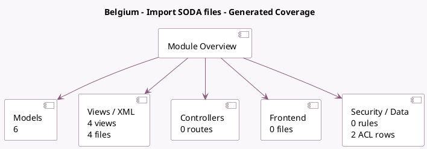

<!-- GENERATED:MODULE -->
---
tags: [odoo, enterprise, module]
---

# Belgium - Import SODA files

- Scope: Enterprise Addons
- Source: enterprise/l10n_be_soda
- Dependencies: [[docs/Enterprise Addons/accountant/accountant|accountant]], [[docs/Community Addons/l10n_be/l10n_be|l10n_be]]

## Generated coverage

- Models: 6
- XML files with UI/data artifacts: 4
- Views: 4
- Actions: 1
- Menus: 0
- Rules (ir.rule): 0
- Access CSV entries: 2
- Controller units: 0
- Frontend asset files: 0

## Module map

## Detail notes

- Models: [[docs/Enterprise Addons/l10n_be_soda/Models|Models]] (6)
- Views and XML: [[docs/Enterprise Addons/l10n_be_soda/Views|Views]] (4 files)

## Key models

- `account.journal`
- `account.move`
- `account.move.line`
- `res.config.settings`
- `soda.account.mapping`
- `soda.import.wizard`

## Navigation

- [[../Enterprise Addons/Enterprise Addons|Back to scope]]
- [[../../docs/docs|Back to docs]]

<!-- GENERATED:MODULE -->

