<!-- GENERATED:MODEL -->
---
tags: [odoo, enterprise, generated, model]
---

# account.external.tax.mixin

- Module: [[docs/Enterprise Addons/l10n_br_avatax/l10n_br_avatax|l10n_br_avatax]]
- Scope: Enterprise Addons
- Defined in module: extension only
- Source files: `models/account_external_tax_mixin.py`
- Python classes: `AccountExternalTaxMixin`

## Field footprint

- Detected fields: 6
- Field types: `Boolean` x 2, `Json` x 1, `Many2one` x 2, `Selection` x 1
- Relation fields: 2

## Sample fields

- `l10n_br_avatax_warnings`: `Json` (compute `_compute_l10n_br_avatax_warnings`)
- `l10n_br_cnae_code_id`: `Many2one` (comodel `l10n_br.cnae.code`, compute `_compute_l10n_br_cnae_code_id`, store `True`)
- `l10n_br_goods_operation_type_id`: `Many2one` (comodel `l10n_br.operation.type`, compute `_compute_l10n_br_goods_operation_type_id`, store `True`)
- `l10n_br_is_avatax`: `Boolean` (compute `_compute_l10n_br_is_avatax`)
- `l10n_br_is_service_transaction`: `Boolean` (comodel `Is Service Transaction`, compute `_compute_l10n_br_is_service_transaction`)
- `l10n_br_use_type`: `Selection`

## Method hints

- Detected methods: 34
- Action methods: none
- Compute methods: `_compute_is_tax_computed_externally`, `_compute_l10n_br_avatax_warnings`, `_compute_l10n_br_cnae_code_id`, `_compute_l10n_br_goods_operation_type_id`, `_compute_l10n_br_is_avatax`, `_compute_l10n_br_is_avatax_depends`, `_compute_l10n_br_is_service_transaction`
- Onchange methods: none

## Direct relation diagram

```plantuml
@startuml
!define ODOO_COLOR_PRIMARY #714B67
!define ODOO_COLOR_ACCENT #875A7B
!define ODOO_COLOR_BG #FAF7FA

skinparam backgroundColor ODOO_COLOR_BG
skinparam defaultTextAlignment left
skinparam ArrowColor ODOO_COLOR_ACCENT
skinparam ClassBackgroundColor white
skinparam ClassBorderColor ODOO_COLOR_PRIMARY
skinparam ComponentBackgroundColor white
skinparam ComponentBorderColor ODOO_COLOR_PRIMARY
skinparam NoteBackgroundColor #FFF8FF
skinparam NoteBorderColor ODOO_COLOR_ACCENT
skinparam SequenceLifeLineBorderColor ODOO_COLOR_ACCENT
skinparam SequenceLifeLineBackgroundColor #FFFFFF
skinparam SequenceParticipantBorderColor ODOO_COLOR_PRIMARY
skinparam SequenceParticipantBackgroundColor #FFFFFF
skinparam sequence {
  ArrowColor ODOO_COLOR_ACCENT
  ActorBorderColor ODOO_COLOR_PRIMARY
}
title account.external.tax.mixin - Direct Relations
class "account.external.tax.mixin" as account_external_tax_mixin
class "l10n_br.cnae.code" as l10n_br_cnae_code
class "l10n_br.operation.type" as l10n_br_operation_type
account_external_tax_mixin --> l10n_br_cnae_code : l10n_br_cnae_code_id
account_external_tax_mixin --> l10n_br_operation_type : l10n_br_goods_operation_type_id
@enduml
```

## Navigation

- **Parent:** [[docs/Enterprise Addons/l10n_br_avatax/Models]]

<!-- GENERATED:MODEL -->
