<!-- GENERATED:MODEL -->
---
tags: [odoo, enterprise, generated, model]
---

# l10n_br.ncm.code

- Module: [[docs/Enterprise Addons/l10n_br_avatax/l10n_br_avatax|l10n_br_avatax]]
- Scope: Enterprise Addons
- Defined in module: yes
- Source files: `models/l10n_br_ncm_code.py`
- Python classes: `L10n_BrNcmCode`
- Description: NCM Code

## Field footprint

- Detected fields: 4
- Field types: `Char` x 3, `Many2one` x 1
- Relation fields: 1

## Sample fields

- `code`: `Char` (comodel `Code`)
- `ex`: `Char`
- `l10n_br_cnae_code_id`: `Many2one` (comodel `l10n_br.cnae.code`)
- `name`: `Char` (comodel `Name`)

## Method hints

- Detected methods: 1
- Action methods: none
- Compute methods: `_compute_display_name`
- Onchange methods: none

## Direct relation diagram

```plantuml
@startuml
!define ODOO_COLOR_PRIMARY #714B67
!define ODOO_COLOR_ACCENT #875A7B
!define ODOO_COLOR_BG #FAF7FA

skinparam backgroundColor ODOO_COLOR_BG
skinparam defaultTextAlignment left
skinparam ArrowColor ODOO_COLOR_ACCENT
skinparam ClassBackgroundColor white
skinparam ClassBorderColor ODOO_COLOR_PRIMARY
skinparam ComponentBackgroundColor white
skinparam ComponentBorderColor ODOO_COLOR_PRIMARY
skinparam NoteBackgroundColor #FFF8FF
skinparam NoteBorderColor ODOO_COLOR_ACCENT
skinparam SequenceLifeLineBorderColor ODOO_COLOR_ACCENT
skinparam SequenceLifeLineBackgroundColor #FFFFFF
skinparam SequenceParticipantBorderColor ODOO_COLOR_PRIMARY
skinparam SequenceParticipantBackgroundColor #FFFFFF
skinparam sequence {
  ArrowColor ODOO_COLOR_ACCENT
  ActorBorderColor ODOO_COLOR_PRIMARY
}
title l10n_br.ncm.code - Direct Relations
class "l10n_br.ncm.code" as l10n_br_ncm_code
class "l10n_br.cnae.code" as l10n_br_cnae_code
l10n_br_ncm_code --> l10n_br_cnae_code : l10n_br_cnae_code_id
@enduml
```

## Navigation

- **Parent:** [[docs/Enterprise Addons/l10n_br_avatax/Models]]

<!-- GENERATED:MODEL -->
