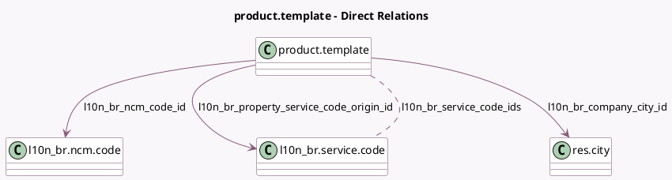

<!-- GENERATED:MODEL -->
---
tags: [odoo, enterprise, generated, model]
---

# product.template

- Module: [[docs/Enterprise Addons/l10n_br_avatax/l10n_br_avatax|l10n_br_avatax]]
- Scope: Enterprise Addons
- Defined in module: extension only
- Source files: `models/product_template.py`
- Python classes: `ProductTemplate`

## Field footprint

- Detected fields: 10
- Field types: `Boolean` x 1, `Char` x 1, `Many2many` x 1, `Many2one` x 3, `Selection` x 4
- Relation fields: 4

## Sample fields

- `l10n_br_cest_code`: `Char`
- `l10n_br_company_city_id`: `Many2one` (comodel `res.city`, compute `_compute_l10n_br_company_city_id`)
- `l10n_br_labor`: `Boolean` (comodel `Labor Assignment`)
- `l10n_br_ncm_code_id`: `Many2one` (comodel `l10n_br.ncm.code`)
- `l10n_br_property_service_code_origin_id`: `Many2one` (comodel `l10n_br.service.code`)
- `l10n_br_service_code_ids`: `Many2many` (comodel `l10n_br.service.code`)
- `l10n_br_source_origin`: `Selection`
- `l10n_br_sped_type`: `Selection`
- `l10n_br_transport_cost_type`: `Selection`
- `l10n_br_use_type`: `Selection`

## Method hints

- Detected methods: 4
- Action methods: none
- Compute methods: `_compute_l10n_br_company_city_id`
- Onchange methods: none

## Direct relation diagram

## Navigation

- **Parent:** [[docs/Enterprise Addons/l10n_br_avatax/Models]]

<!-- GENERATED:MODEL -->
