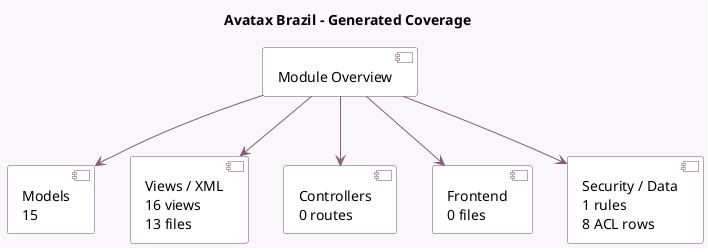

<!-- GENERATED:MODULE -->
---
tags: [odoo, enterprise, module]
---

# Avatax Brazil

- Scope: Enterprise Addons
- Source: enterprise/l10n_br_avatax
- Dependencies: [[docs/Community Addons/iap/iap|iap]], [[docs/Community Addons/l10n_br/l10n_br|l10n_br]], [[docs/Enterprise Addons/account_external_tax/account_external_tax|account_external_tax]]

## Generated coverage

- Models: 15
- XML files with UI/data artifacts: 13
- Views: 16
- Actions: 4
- Menus: 3
- Rules (ir.rule): 1
- Access CSV entries: 8
- Controller units: 0
- Frontend asset files: 0

## Module map

## Detail notes

- Models: [[docs/Enterprise Addons/l10n_br_avatax/Models|Models]] (15)
- Views and XML: [[docs/Enterprise Addons/l10n_br_avatax/Views|Views]] (13 files)

## Key models

- `account.chart.template`
- `account.external.tax.mixin`
- `account.fiscal.position`
- `account.move`
- `account.move.line`
- `account.tax`
- `l10n_br.cnae.code`
- `l10n_br.ncm.code`
- `l10n_br.operation.type`
- `l10n_br.service.code`
- `product.product`
- `product.template`

## Navigation

- [[../Enterprise Addons/Enterprise Addons|Back to scope]]
- [[../../docs/docs|Back to docs]]

<!-- GENERATED:MODULE -->

