<!-- GENERATED:MODEL -->
---
tags: [odoo, enterprise, generated, model]
---

# account.move

- Module: [[docs/Enterprise Addons/l10n_br_edi/l10n_br_edi|l10n_br_edi]]
- Scope: Enterprise Addons
- Defined in module: extension only
- Source files: `models/account_move.py`
- Python classes: `AccountMove`

## Field footprint

- Detected fields: 13
- Field types: `Binary` x 1, `Boolean` x 1, `Char` x 3, `Integer` x 1, `Many2one` x 2, `Selection` x 3, `Text` x 2
- Relation fields: 2

## Sample fields

- `l10n_br_access_key`: `Char` (comodel `Access Key`)
- `l10n_br_edi_avatax_data`: `Text`
- `l10n_br_edi_error`: `Text` (comodel `Brazil E-Invoice Error`)
- `l10n_br_edi_freight_model`: `Selection`
- `l10n_br_edi_is_needed`: `Boolean` (compute `_compute_l10n_br_edi_is_needed`)
- `l10n_br_edi_last_correction_number`: `Integer` (comodel `Brazil Correction Number`)
- `l10n_br_edi_payment_method`: `Selection`
- `l10n_br_edi_transporter_id`: `Many2one` (comodel `res.partner`)
- `l10n_br_edi_xml_attachment_file`: `Binary`
- `l10n_br_edi_xml_attachment_id`: `Many2one` (comodel `ir.attachment`)
- `l10n_br_last_edi_status`: `Selection`
- `l10n_br_nfse_number`: `Char` (comodel `NFS-e Number`)
- `l10n_br_nfse_verification`: `Char` (comodel `NFS-e Verification Code`)

## Method hints

- Detected methods: 43
- Action methods: none
- Compute methods: `_compute_display_send_button`, `_compute_highlight_send_button`, `_compute_l10n_br_avatax_warnings`, `_compute_l10n_br_edi_is_needed`, `_compute_need_cancel_request`, `_compute_show_reset_to_draft_button`
- Onchange methods: none

## Direct relation diagram

```plantuml
@startuml
!define ODOO_COLOR_PRIMARY #714B67
!define ODOO_COLOR_ACCENT #875A7B
!define ODOO_COLOR_BG #FAF7FA

skinparam backgroundColor ODOO_COLOR_BG
skinparam defaultTextAlignment left
skinparam ArrowColor ODOO_COLOR_ACCENT
skinparam ClassBackgroundColor white
skinparam ClassBorderColor ODOO_COLOR_PRIMARY
skinparam ComponentBackgroundColor white
skinparam ComponentBorderColor ODOO_COLOR_PRIMARY
skinparam NoteBackgroundColor #FFF8FF
skinparam NoteBorderColor ODOO_COLOR_ACCENT
skinparam SequenceLifeLineBorderColor ODOO_COLOR_ACCENT
skinparam SequenceLifeLineBackgroundColor #FFFFFF
skinparam SequenceParticipantBorderColor ODOO_COLOR_PRIMARY
skinparam SequenceParticipantBackgroundColor #FFFFFF
skinparam sequence {
  ArrowColor ODOO_COLOR_ACCENT
  ActorBorderColor ODOO_COLOR_PRIMARY
}
title account.move - Direct Relations
class "account.move" as account_move
class "ir.attachment" as ir_attachment
class "res.partner" as res_partner
account_move --> res_partner : l10n_br_edi_transporter_id
account_move --> ir_attachment : l10n_br_edi_xml_attachment_id
@enduml
```

## Navigation

- **Parent:** [[docs/Enterprise Addons/l10n_br_edi/Models]]

<!-- GENERATED:MODEL -->
