<!-- GENERATED:MODEL -->
---
tags: [odoo, enterprise, generated, model]
---

# l10n_br_edi.cancel.range

- Module: [[docs/Enterprise Addons/l10n_br_edi/l10n_br_edi|l10n_br_edi]]
- Scope: Enterprise Addons
- Defined in module: yes
- Source files: `wizard/l10n_br_edi_cancel_range.py`
- Python classes: `L10n_Br_EdiCancelRange`
- Description: This allows a user to inform the government a range of sequence numbers won't be used.

## Field footprint

- Detected fields: 5
- Field types: `Char` x 1, `Integer` x 2, `Many2one` x 2
- Relation fields: 2

## Sample fields

- `document_type_id`: `Many2one` (comodel `l10n_latam.document.type`)
- `end_number`: `Integer` (comodel `End number`)
- `journal_id`: `Many2one` (comodel `account.journal`)
- `reason`: `Char` (comodel `Reason`)
- `start_number`: `Integer` (comodel `Start number`)

## Method hints

- Detected methods: 1
- Action methods: `action_submit`
- Compute methods: none
- Onchange methods: none

## Direct relation diagram

```plantuml
@startuml
!define ODOO_COLOR_PRIMARY #714B67
!define ODOO_COLOR_ACCENT #875A7B
!define ODOO_COLOR_BG #FAF7FA

skinparam backgroundColor ODOO_COLOR_BG
skinparam defaultTextAlignment left
skinparam ArrowColor ODOO_COLOR_ACCENT
skinparam ClassBackgroundColor white
skinparam ClassBorderColor ODOO_COLOR_PRIMARY
skinparam ComponentBackgroundColor white
skinparam ComponentBorderColor ODOO_COLOR_PRIMARY
skinparam NoteBackgroundColor #FFF8FF
skinparam NoteBorderColor ODOO_COLOR_ACCENT
skinparam SequenceLifeLineBorderColor ODOO_COLOR_ACCENT
skinparam SequenceLifeLineBackgroundColor #FFFFFF
skinparam SequenceParticipantBorderColor ODOO_COLOR_PRIMARY
skinparam SequenceParticipantBackgroundColor #FFFFFF
skinparam sequence {
  ArrowColor ODOO_COLOR_ACCENT
  ActorBorderColor ODOO_COLOR_PRIMARY
}
title l10n_br_edi.cancel.range - Direct Relations
class "l10n_br_edi.cancel.range" as l10n_br_edi_cancel_range
class "account.journal" as account_journal
class "l10n_latam.document.type" as l10n_latam_document_type
l10n_br_edi_cancel_range --> account_journal : journal_id
l10n_br_edi_cancel_range --> l10n_latam_document_type : document_type_id
@enduml
```

## Navigation

- **Parent:** [[docs/Enterprise Addons/l10n_br_edi/Models]]

<!-- GENERATED:MODEL -->
