<!-- GENERATED:MODEL -->
---
tags: [odoo, enterprise, generated, model]
---

# l10n_br_edi.invoice.update

- Module: [[docs/Enterprise Addons/l10n_br_edi/l10n_br_edi|l10n_br_edi]]
- Scope: Enterprise Addons
- Defined in module: yes
- Source files: `wizard/l10n_br_edi_invoice_update.py`
- Python classes: `L10n_Br_EdiInvoiceUpdate`
- Description: Implements both correcting and cancelling an invoice.

## Field footprint

- Detected fields: 5
- Field types: `Boolean` x 2, `Char` x 1, `Many2one` x 1, `Selection` x 1
- Relation fields: 1

## Sample fields

- `is_service_invoice`: `Boolean` (comodel `Is Service Invoice`, related `move_id.l10n_br_is_service_transaction`)
- `mode`: `Selection`
- `move_id`: `Many2one` (comodel `account.move`)
- `reason`: `Char` (comodel `Reason`)
- `send_email`: `Boolean` (comodel `Email`)

## Method hints

- Detected methods: 7
- Action methods: `action_submit`
- Compute methods: none
- Onchange methods: none

## Direct relation diagram

```plantuml
@startuml
!define ODOO_COLOR_PRIMARY #714B67
!define ODOO_COLOR_ACCENT #875A7B
!define ODOO_COLOR_BG #FAF7FA

skinparam backgroundColor ODOO_COLOR_BG
skinparam defaultTextAlignment left
skinparam ArrowColor ODOO_COLOR_ACCENT
skinparam ClassBackgroundColor white
skinparam ClassBorderColor ODOO_COLOR_PRIMARY
skinparam ComponentBackgroundColor white
skinparam ComponentBorderColor ODOO_COLOR_PRIMARY
skinparam NoteBackgroundColor #FFF8FF
skinparam NoteBorderColor ODOO_COLOR_ACCENT
skinparam SequenceLifeLineBorderColor ODOO_COLOR_ACCENT
skinparam SequenceLifeLineBackgroundColor #FFFFFF
skinparam SequenceParticipantBorderColor ODOO_COLOR_PRIMARY
skinparam SequenceParticipantBackgroundColor #FFFFFF
skinparam sequence {
  ArrowColor ODOO_COLOR_ACCENT
  ActorBorderColor ODOO_COLOR_PRIMARY
}
title l10n_br_edi.invoice.update - Direct Relations
class "l10n_br_edi.invoice.update" as l10n_br_edi_invoice_update
class "account.move" as account_move
l10n_br_edi_invoice_update --> account_move : move_id
@enduml
```

## Navigation

- **Parent:** [[docs/Enterprise Addons/l10n_br_edi/Models]]

<!-- GENERATED:MODEL -->
