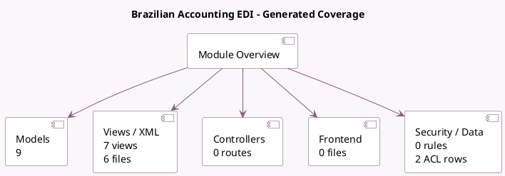

<!-- GENERATED:MODULE -->
---
tags: [odoo, enterprise, module]
---

# Brazilian Accounting EDI

- Scope: Enterprise Addons
- Source: enterprise/l10n_br_edi
- Dependencies: [[docs/Enterprise Addons/l10n_br_avatax/l10n_br_avatax|l10n_br_avatax]]

## Generated coverage

- Models: 9
- XML files with UI/data artifacts: 6
- Views: 7
- Actions: 1
- Menus: 0
- Rules (ir.rule): 0
- Access CSV entries: 2
- Controller units: 0
- Frontend asset files: 0

## Module map

## Detail notes

- Models: [[docs/Enterprise Addons/l10n_br_edi/Models|Models]] (9)
- Views and XML: [[docs/Enterprise Addons/l10n_br_edi/Views|Views]] (6 files)

## Key models

- `account.external.tax.mixin`
- `account.move`
- `account.move.line`
- `account.move.send`
- `l10n_br.operation.type`
- `l10n_br_edi.cancel.range`
- `l10n_br_edi.invoice.update`
- `payment.method`
- `res.country`

## Navigation

- [[../Enterprise Addons/Enterprise Addons|Back to scope]]
- [[../../docs/docs|Back to docs]]

<!-- GENERATED:MODULE -->

