<!-- GENERATED:MODEL -->
---
tags: [odoo, enterprise, generated, model]
---

# pos.order

- Module: [[docs/Enterprise Addons/l10n_br_edi_pos/l10n_br_edi_pos|l10n_br_edi_pos]]
- Scope: Enterprise Addons
- Defined in module: yes
- Source files: `models/pos_order.py`
- Python classes: `PosOrder`
- Inherits: `account.external.tax.mixin`

## Field footprint

- Detected fields: 12
- Field types: `Binary` x 2, `Boolean` x 1, `Char` x 5, `Json` x 1, `Many2one` x 1, `Selection` x 1, `Text` x 1
- Relation fields: 1

## Sample fields

- `l10n_br_access_key`: `Char` (comodel `Access Key`)
- `l10n_br_avatax_error`: `Text` (comodel `Brazil Avatax Error`)
- `l10n_br_edi_authorization_date`: `Char` (comodel `Authorization Date`)
- `l10n_br_edi_avatax_data`: `Json`
- `l10n_br_edi_number`: `Char` (comodel `NFC-e Number`, compute `_compute_l10n_br_edi_number`)
- `l10n_br_edi_pdf_attachment_file`: `Binary`
- `l10n_br_edi_processed_by_cron`: `Boolean`
- `l10n_br_edi_protocol_authorization_number`: `Char` (comodel `Protocol Authorization Number`)
- `l10n_br_edi_series`: `Char` (comodel `Series`)
- `l10n_br_edi_triggered_user_id`: `Many2one` (comodel `res.users`)
- `l10n_br_edi_xml_attachment_file`: `Binary`
- `l10n_br_last_avatax_status`: `Selection`

## Method hints

- Detected methods: 37
- Action methods: `action_pos_order_invoice`, `action_send_nfce_batch`
- Compute methods: `_compute_l10n_br_edi_number`, `_compute_l10n_br_is_avatax`
- Onchange methods: none

## Direct relation diagram

```plantuml
@startuml
!define ODOO_COLOR_PRIMARY #714B67
!define ODOO_COLOR_ACCENT #875A7B
!define ODOO_COLOR_BG #FAF7FA

skinparam backgroundColor ODOO_COLOR_BG
skinparam defaultTextAlignment left
skinparam ArrowColor ODOO_COLOR_ACCENT
skinparam ClassBackgroundColor white
skinparam ClassBorderColor ODOO_COLOR_PRIMARY
skinparam ComponentBackgroundColor white
skinparam ComponentBorderColor ODOO_COLOR_PRIMARY
skinparam NoteBackgroundColor #FFF8FF
skinparam NoteBorderColor ODOO_COLOR_ACCENT
skinparam SequenceLifeLineBorderColor ODOO_COLOR_ACCENT
skinparam SequenceLifeLineBackgroundColor #FFFFFF
skinparam SequenceParticipantBorderColor ODOO_COLOR_PRIMARY
skinparam SequenceParticipantBackgroundColor #FFFFFF
skinparam sequence {
  ArrowColor ODOO_COLOR_ACCENT
  ActorBorderColor ODOO_COLOR_PRIMARY
}
title pos.order - Direct Relations
class "pos.order" as pos_order
class "res.users" as res_users
pos_order --> res_users : l10n_br_edi_triggered_user_id
@enduml
```

## Navigation

- **Parent:** [[docs/Enterprise Addons/l10n_br_edi_pos/Models]]

<!-- GENERATED:MODEL -->
