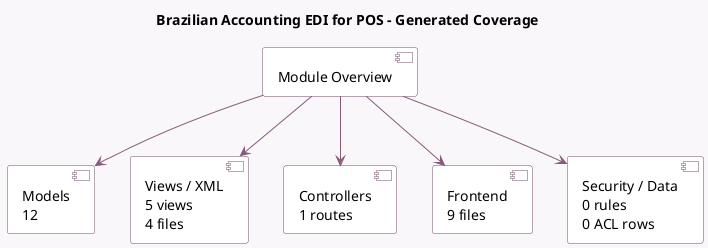

<!-- GENERATED:MODULE -->
---
tags: [odoo, enterprise, module]
---

# Brazilian Accounting EDI for POS

- Scope: Enterprise Addons
- Source: enterprise/l10n_br_edi_pos
- Dependencies: [[docs/Enterprise Addons/l10n_br_edi/l10n_br_edi|l10n_br_edi]], [[docs/Community Addons/point_of_sale/point_of_sale|point_of_sale]]

## Generated coverage

- Models: 12
- XML files with UI/data artifacts: 4
- Views: 5
- Actions: 2
- Menus: 0
- Rules (ir.rule): 0
- Access CSV entries: 0
- Controller units: 1
- Frontend asset files: 9

## Module map

## Detail notes

- Models: [[docs/Enterprise Addons/l10n_br_edi_pos/Models|Models]] (12)
- Views and XML: [[docs/Enterprise Addons/l10n_br_edi_pos/Views|Views]] (4 files)
- Controllers: [[docs/Enterprise Addons/l10n_br_edi_pos/Controllers|Controllers]] (1)
- Frontend: [[docs/Enterprise Addons/l10n_br_edi_pos/Frontend|Frontend]] (9 files)

## Key models

- `account.move`
- `account.tax`
- `l10n_latam.identification.type`
- `pos.config`
- `pos.make.payment`
- `pos.order`
- `pos.payment.method`
- `pos.session`
- `product.template`
- `res.company`
- `res.config.settings`
- `res.partner`

## Navigation

- [[../Enterprise Addons/Enterprise Addons|Back to scope]]
- [[../../docs/docs|Back to docs]]

<!-- GENERATED:MODULE -->

