<!-- GENERATED:MODEL -->
---
tags: [odoo, enterprise, generated, model]
---

# account.move

- Module: [[docs/Enterprise Addons/l10n_br_edi_stock/l10n_br_edi_stock|l10n_br_edi_stock]]
- Scope: Enterprise Addons
- Defined in module: extension only
- Source files: `models/account_move.py`
- Python classes: `AccountMove`

## Field footprint

- Detected fields: 4
- Field types: `Char` x 1, `Integer` x 1, `Many2many` x 1, `One2many` x 1
- Relation fields: 2

## Sample fields

- `l10n_br_package_ids`: `One2many` (comodel `stock.package`)
- `l10n_br_picking_count`: `Integer` (compute `_compute_l10n_br_picking_count`)
- `l10n_br_plate_number`: `Char` (comodel `Plate Number`)
- `l10n_br_related_package_ids`: `Many2many` (comodel `stock.package`, compute `_compute_l10n_br_related_package_ids`)

## Method hints

- Detected methods: 5
- Action methods: `action_l10n_br_view_pickings`
- Compute methods: `_compute_l10n_br_picking_count`, `_compute_l10n_br_related_package_ids`
- Onchange methods: none

## Direct relation diagram

```plantuml
@startuml
!define ODOO_COLOR_PRIMARY #714B67
!define ODOO_COLOR_ACCENT #875A7B
!define ODOO_COLOR_BG #FAF7FA

skinparam backgroundColor ODOO_COLOR_BG
skinparam defaultTextAlignment left
skinparam ArrowColor ODOO_COLOR_ACCENT
skinparam ClassBackgroundColor white
skinparam ClassBorderColor ODOO_COLOR_PRIMARY
skinparam ComponentBackgroundColor white
skinparam ComponentBorderColor ODOO_COLOR_PRIMARY
skinparam NoteBackgroundColor #FFF8FF
skinparam NoteBorderColor ODOO_COLOR_ACCENT
skinparam SequenceLifeLineBorderColor ODOO_COLOR_ACCENT
skinparam SequenceLifeLineBackgroundColor #FFFFFF
skinparam SequenceParticipantBorderColor ODOO_COLOR_PRIMARY
skinparam SequenceParticipantBackgroundColor #FFFFFF
skinparam sequence {
  ArrowColor ODOO_COLOR_ACCENT
  ActorBorderColor ODOO_COLOR_PRIMARY
}
title account.move - Direct Relations
class "account.move" as account_move
class "stock.package" as stock_package
account_move .. stock_package : l10n_br_related_package_ids
account_move --|> stock_package : l10n_br_package_ids
@enduml
```

## Navigation

- **Parent:** [[docs/Enterprise Addons/l10n_br_edi_stock/Models]]

<!-- GENERATED:MODEL -->
