<!-- GENERATED:MODEL -->
---
tags: [odoo, enterprise, generated, model]
---

# account.journal

- Module: [[docs/Enterprise Addons/l10n_ca_payment_cpa005/l10n_ca_payment_cpa005|l10n_ca_payment_cpa005]]
- Scope: Enterprise Addons
- Defined in module: extension only
- Source files: `models/account_journal.py`
- Python classes: `AccountJournal`

## Field footprint

- Detected fields: 4
- Field types: `Char` x 2, `Integer` x 1, `Many2one` x 1
- Relation fields: 1

## Sample fields

- `l10n_ca_cpa005_destination_data_center`: `Char` (comodel `Destination Data Center`)
- `l10n_ca_cpa005_fcn_number_next`: `Integer` (comodel `Next File Creation Number (FCN)`, compute `_compute_l10n_ca_cpa005_fcn_number_next`)
- `l10n_ca_cpa005_fcn_sequence_id`: `Many2one` (comodel `ir.sequence`)
- `l10n_ca_cpa005_originator_id`: `Char` (comodel `Originator ID`)

## Method hints

- Detected methods: 6
- Action methods: none
- Compute methods: `_compute_l10n_ca_cpa005_fcn_number_next`
- Onchange methods: none

## Direct relation diagram

```plantuml
@startuml
!define ODOO_COLOR_PRIMARY #714B67
!define ODOO_COLOR_ACCENT #875A7B
!define ODOO_COLOR_BG #FAF7FA

skinparam backgroundColor ODOO_COLOR_BG
skinparam defaultTextAlignment left
skinparam ArrowColor ODOO_COLOR_ACCENT
skinparam ClassBackgroundColor white
skinparam ClassBorderColor ODOO_COLOR_PRIMARY
skinparam ComponentBackgroundColor white
skinparam ComponentBorderColor ODOO_COLOR_PRIMARY
skinparam NoteBackgroundColor #FFF8FF
skinparam NoteBorderColor ODOO_COLOR_ACCENT
skinparam SequenceLifeLineBorderColor ODOO_COLOR_ACCENT
skinparam SequenceLifeLineBackgroundColor #FFFFFF
skinparam SequenceParticipantBorderColor ODOO_COLOR_PRIMARY
skinparam SequenceParticipantBackgroundColor #FFFFFF
skinparam sequence {
  ArrowColor ODOO_COLOR_ACCENT
  ActorBorderColor ODOO_COLOR_PRIMARY
}
title account.journal - Direct Relations
class "account.journal" as account_journal
class "ir.sequence" as ir_sequence
account_journal --> ir_sequence : l10n_ca_cpa005_fcn_sequence_id
@enduml
```

## Navigation

- **Parent:** [[docs/Enterprise Addons/l10n_ca_payment_cpa005/Models]]

<!-- GENERATED:MODEL -->
