<!-- GENERATED:MODEL -->
---
tags: [odoo, enterprise, generated, model]
---

# account.payment

- Module: [[docs/Enterprise Addons/l10n_ca_payment_cpa005/l10n_ca_payment_cpa005|l10n_ca_payment_cpa005]]
- Scope: Enterprise Addons
- Defined in module: extension only
- Source files: `models/account_payment.py`
- Python classes: `AccountPayment`

## Field footprint

- Detected fields: 1
- Field types: `Many2one` x 1
- Relation fields: 1

## Sample fields

- `l10n_ca_cpa005_transaction_code_id`: `Many2one` (comodel `l10n_ca_cpa005.transaction.code`)

## Method hints

- Detected methods: 2
- Action methods: none
- Compute methods: none
- Onchange methods: none

## Direct relation diagram

```plantuml
@startuml
!define ODOO_COLOR_PRIMARY #714B67
!define ODOO_COLOR_ACCENT #875A7B
!define ODOO_COLOR_BG #FAF7FA

skinparam backgroundColor ODOO_COLOR_BG
skinparam defaultTextAlignment left
skinparam ArrowColor ODOO_COLOR_ACCENT
skinparam ClassBackgroundColor white
skinparam ClassBorderColor ODOO_COLOR_PRIMARY
skinparam ComponentBackgroundColor white
skinparam ComponentBorderColor ODOO_COLOR_PRIMARY
skinparam NoteBackgroundColor #FFF8FF
skinparam NoteBorderColor ODOO_COLOR_ACCENT
skinparam SequenceLifeLineBorderColor ODOO_COLOR_ACCENT
skinparam SequenceLifeLineBackgroundColor #FFFFFF
skinparam SequenceParticipantBorderColor ODOO_COLOR_PRIMARY
skinparam SequenceParticipantBackgroundColor #FFFFFF
skinparam sequence {
  ArrowColor ODOO_COLOR_ACCENT
  ActorBorderColor ODOO_COLOR_PRIMARY
}
title account.payment - Direct Relations
class "account.payment" as account_payment
class "l10n_ca_cpa005.transaction.code" as l10n_ca_cpa005_transaction_code
account_payment --> l10n_ca_cpa005_transaction_code : l10n_ca_cpa005_transaction_code_id
@enduml
```

## Navigation

- **Parent:** [[docs/Enterprise Addons/l10n_ca_payment_cpa005/Models]]

<!-- GENERATED:MODEL -->
