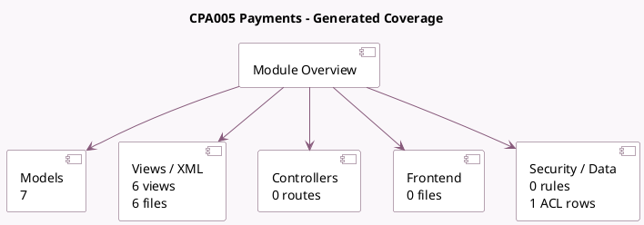

<!-- GENERATED:MODULE -->
---
tags: [odoo, enterprise, module]
---

# CPA005 Payments

- Scope: Enterprise Addons
- Source: enterprise/l10n_ca_payment_cpa005
- Dependencies: [[docs/Enterprise Addons/account_batch_payment/account_batch_payment|account_batch_payment]], [[docs/Community Addons/l10n_ca/l10n_ca|l10n_ca]]

## Summary

Export payments as CPA 005 AFT files

## Generated coverage

- Models: 7
- XML files with UI/data artifacts: 6
- Views: 6
- Actions: 1
- Menus: 2
- Rules (ir.rule): 0
- Access CSV entries: 1
- Controller units: 0
- Frontend asset files: 0

## Module map

## Detail notes

- Models: [[docs/Enterprise Addons/l10n_ca_payment_cpa005/Models|Models]] (7)
- Views and XML: [[docs/Enterprise Addons/l10n_ca_payment_cpa005/Views|Views]] (6 files)

## Key models

- `account.batch.payment`
- `account.journal`
- `account.payment`
- `account.payment.method`
- `l10n_ca_cpa005.transaction.code`
- `res.company`
- `res.partner.bank`

## Navigation

- [[../Enterprise Addons/Enterprise Addons|Back to scope]]
- [[../../docs/docs|Back to docs]]

<!-- GENERATED:MODULE -->

