<!-- GENERATED:MODEL -->
---
tags: [odoo, enterprise, generated, model]
---

# ch.yearly.report

- Module: [[docs/Enterprise Addons/l10n_ch_hr_payroll/l10n_ch_hr_payroll|l10n_ch_hr_payroll]]
- Scope: Enterprise Addons
- Defined in module: yes
- Source files: `models/l10n_ch_insurance_report.py`
- Python classes: `L10nCHInsuranceReport`
- Description: CH Yearly Report
- Inherits: `l10n.ch.swissdec.transmitter`

## Field footprint

- Detected fields: 9
- Field types: `Boolean` x 2, `Integer` x 1, `Many2many` x 6
- Relation fields: 6

## Sample fields

- `avs_institution_ids`: `Many2many` (comodel `l10n.ch.social.insurance`)
- `caf_institution_ids`: `Many2many` (comodel `l10n.ch.compensation.fund`)
- `ijm_institution_ids`: `Many2many` (comodel `l10n.ch.sickness.insurance`)
- `incomplete_declaration`: `Boolean`
- `laa_institution_ids`: `Many2many` (comodel `l10n.ch.accident.insurance`)
- `laac_institution_ids`: `Many2many` (comodel `l10n.ch.additional.accident.insurance`)
- `tax_certificates`: `Boolean`
- `tax_cross_border_institutions`: `Many2many` (comodel `l10n.ch.source.tax.institution`)
- `wage_statement_count`: `Integer` (compute `_compute_wage_statement_count`)

## Method hints

- Detected methods: 16
- Action methods: `action_open_wage_statements`, `action_prepare_data`
- Compute methods: `_compute_actionable_warnings`, `_compute_wage_statement_count`
- Onchange methods: none

## Direct relation diagram

```plantuml
@startuml
!define ODOO_COLOR_PRIMARY #714B67
!define ODOO_COLOR_ACCENT #875A7B
!define ODOO_COLOR_BG #FAF7FA

skinparam backgroundColor ODOO_COLOR_BG
skinparam defaultTextAlignment left
skinparam ArrowColor ODOO_COLOR_ACCENT
skinparam ClassBackgroundColor white
skinparam ClassBorderColor ODOO_COLOR_PRIMARY
skinparam ComponentBackgroundColor white
skinparam ComponentBorderColor ODOO_COLOR_PRIMARY
skinparam NoteBackgroundColor #FFF8FF
skinparam NoteBorderColor ODOO_COLOR_ACCENT
skinparam SequenceLifeLineBorderColor ODOO_COLOR_ACCENT
skinparam SequenceLifeLineBackgroundColor #FFFFFF
skinparam SequenceParticipantBorderColor ODOO_COLOR_PRIMARY
skinparam SequenceParticipantBackgroundColor #FFFFFF
skinparam sequence {
  ArrowColor ODOO_COLOR_ACCENT
  ActorBorderColor ODOO_COLOR_PRIMARY
}
title ch.yearly.report - Direct Relations
class "ch.yearly.report" as ch_yearly_report
class "l10n.ch.accident.insurance" as l10n_ch_accident_insurance
class "l10n.ch.additional.accident.insurance" as l10n_ch_additional_accident_insurance
class "l10n.ch.compensation.fund" as l10n_ch_compensation_fund
class "l10n.ch.sickness.insurance" as l10n_ch_sickness_insurance
class "l10n.ch.social.insurance" as l10n_ch_social_insurance
class "l10n.ch.source.tax.institution" as l10n_ch_source_tax_institution
ch_yearly_report .. l10n_ch_source_tax_institution : tax_cross_border_institutions
ch_yearly_report .. l10n_ch_social_insurance : avs_institution_ids
ch_yearly_report .. l10n_ch_accident_insurance : laa_institution_ids
ch_yearly_report .. l10n_ch_additional_accident_insurance : laac_institution_ids
ch_yearly_report .. l10n_ch_sickness_insurance : ijm_institution_ids
ch_yearly_report .. l10n_ch_compensation_fund : caf_institution_ids
@enduml
```

## Navigation

- **Parent:** [[docs/Enterprise Addons/l10n_ch_hr_payroll/Models]]

<!-- GENERATED:MODEL -->
