<!-- GENERATED:MODEL -->
---
tags: [odoo, enterprise, generated, model]
---

# hr.employee.is.line.correction

- Module: [[docs/Enterprise Addons/l10n_ch_hr_payroll/l10n_ch_hr_payroll|l10n_ch_hr_payroll]]
- Scope: Enterprise Addons
- Defined in module: yes
- Source files: `models/hr_employee_is_line.py`
- Python classes: `L10nCHIsCorrectionLine`
- Description: Source-Tax Manual Correction

## Field footprint

- Detected fields: 21
- Field types: `Boolean` x 1, `Char` x 3, `Float` x 8, `Integer` x 1, `Many2one` x 3, `Selection` x 5
- Relation fields: 3

## Sample fields

- `children`: `Integer`
- `employee_id`: `Many2one` (related `is_correction_id.employee_id`)
- `insurance_days`: `Float` (compute `_compute_default_is_values`, store `True`)
- `is_correction_id`: `Many2one` (comodel `hr.employee.is.line`)
- `l10n_ch_church_tax`: `Boolean`
- `l10n_ch_open_tax_scale`: `Char`
- `l10n_ch_pre_defined_tax_scale`: `Selection`
- `l10n_ch_source_tax_canton`: `Selection` (compute `_compute_default_is_values`, store `True`)
- `l10n_ch_source_tax_municipality`: `Char`
- `l10n_ch_tax_scale`: `Selection`
- `l10n_ch_tax_scale_type`: `Selection`
- `payslip_id`: `Many2one` (comodel `hr.payslip`)
- `rate_determinant_salary`: `Float` (compute `_compute_default_is_values`, store `True`)
- `source_tax_amount`: `Float` (compute `_compute_default_is_values`, store `True`)
- `source_tax_aperiodic_determinant_salary`: `Float` (compute `_compute_default_is_values`, store `True`)
- `source_tax_periodic_determinant_salary`: `Float` (compute `_compute_default_is_values`, store `True`)
- `source_tax_salary`: `Float` (compute `_compute_default_is_values`, store `True`)
- `state`: `Selection` (related `is_correction_id.state`)
- `tax_code`: `Char` (compute `_compute_l10n_ch_tax_code`)
- `worked_days`: `Float` (compute `_compute_default_is_values`, store `True`)

## Method hints

- Detected methods: 2
- Action methods: none
- Compute methods: `_compute_default_is_values`, `_compute_l10n_ch_tax_code`
- Onchange methods: none

## Direct relation diagram

```plantuml
@startuml
!define ODOO_COLOR_PRIMARY #714B67
!define ODOO_COLOR_ACCENT #875A7B
!define ODOO_COLOR_BG #FAF7FA

skinparam backgroundColor ODOO_COLOR_BG
skinparam defaultTextAlignment left
skinparam ArrowColor ODOO_COLOR_ACCENT
skinparam ClassBackgroundColor white
skinparam ClassBorderColor ODOO_COLOR_PRIMARY
skinparam ComponentBackgroundColor white
skinparam ComponentBorderColor ODOO_COLOR_PRIMARY
skinparam NoteBackgroundColor #FFF8FF
skinparam NoteBorderColor ODOO_COLOR_ACCENT
skinparam SequenceLifeLineBorderColor ODOO_COLOR_ACCENT
skinparam SequenceLifeLineBackgroundColor #FFFFFF
skinparam SequenceParticipantBorderColor ODOO_COLOR_PRIMARY
skinparam SequenceParticipantBackgroundColor #FFFFFF
skinparam sequence {
  ArrowColor ODOO_COLOR_ACCENT
  ActorBorderColor ODOO_COLOR_PRIMARY
}
title hr.employee.is.line.correction - Direct Relations
class "hr.employee.is.line.correction" as hr_employee_is_line_correction
class "hr.employee.is.line" as hr_employee_is_line
class "hr.payslip" as hr_payslip
hr_employee_is_line_correction --> hr_employee_is_line : is_correction_id
hr_employee_is_line_correction --> hr_payslip : payslip_id
@enduml
```

## Navigation

- **Parent:** [[docs/Enterprise Addons/l10n_ch_hr_payroll/Models]]

<!-- GENERATED:MODEL -->
