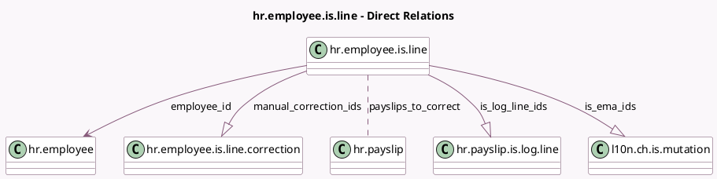

<!-- GENERATED:MODEL -->
---
tags: [odoo, enterprise, generated, model]
---

# hr.employee.is.line

- Module: [[docs/Enterprise Addons/l10n_ch_hr_payroll/l10n_ch_hr_payroll|l10n_ch_hr_payroll]]
- Scope: Enterprise Addons
- Defined in module: yes
- Source files: `models/hr_employee_is_line.py`
- Python classes: `HrEmployeeIsLine`
- Description: IS Entry / Withdrawals / Mutations

## Field footprint

- Detected fields: 10
- Field types: `Boolean` x 1, `Char` x 1, `Many2many` x 1, `Many2one` x 1, `One2many` x 3, `Selection` x 3
- Relation fields: 5

## Sample fields

- `active`: `Boolean`
- `correction_method`: `Selection`
- `correction_type`: `Selection`
- `employee_id`: `Many2one` (comodel `hr.employee`)
- `is_ema_ids`: `One2many` (comodel `l10n.ch.is.mutation`)
- `is_log_line_ids`: `One2many` (comodel `hr.payslip.is.log.line`)
- `manual_correction_ids`: `One2many` (comodel `hr.employee.is.line.correction`)
- `payslips_to_correct`: `Many2many` (comodel `hr.payslip`)
- `reason`: `Char`
- `state`: `Selection`

## Method hints

- Detected methods: 4
- Action methods: `action_done`, `action_draft`, `action_pending`
- Compute methods: `_compute_display_name`
- Onchange methods: none

## Direct relation diagram

## Navigation

- **Parent:** [[docs/Enterprise Addons/l10n_ch_hr_payroll/Models]]

<!-- GENERATED:MODEL -->
