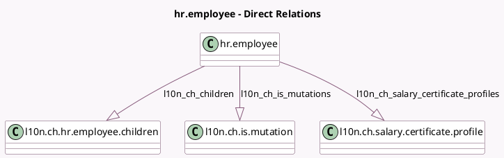

<!-- GENERATED:MODEL -->
---
tags: [odoo, enterprise, generated, model]
---

# hr.employee

- Module: [[docs/Enterprise Addons/l10n_ch_hr_payroll/l10n_ch_hr_payroll|l10n_ch_hr_payroll]]
- Scope: Enterprise Addons
- Defined in module: extension only
- Source files: `models/hr_employee.py`
- Python classes: `HrEmployee`

## Field footprint

- Detected fields: 39
- Field types: `Boolean` x 9, `Char` x 7, `Float` x 10, `Integer` x 1, `Many2one` x 1, `Monetary` x 1, `One2many` x 4, `Selection` x 6
- Relation fields: 5

## Sample fields

- `certificate`: `Selection`
- `irregular_working_time`: `Boolean` (related `version_id.irregular_working_time`)
- `l10n_ch_children`: `One2many` (comodel `l10n.ch.hr.employee.children`)
- `l10n_ch_church_tax`: `Boolean` (related `version_id.l10n_ch_church_tax`)
- `l10n_ch_contract_wage_ids`: `One2many` (related `version_id.l10n_ch_contract_wage_ids`)
- `l10n_ch_contractual_13th_month_rate`: `Float` (related `version_id.l10n_ch_contractual_13th_month_rate`)
- `l10n_ch_contractual_annual_wage`: `Monetary` (related `version_id.l10n_ch_contractual_annual_wage`)
- `l10n_ch_contractual_holidays_rate`: `Float` (related `version_id.l10n_ch_contractual_holidays_rate`)
- `l10n_ch_contractual_public_holidays_rate`: `Float` (related `version_id.l10n_ch_contractual_public_holidays_rate`)
- `l10n_ch_contractual_vacation_pay`: `Boolean` (related `version_id.l10n_ch_contractual_vacation_pay`)
- `l10n_ch_current_occupation_rate`: `Float` (related `version_id.l10n_ch_current_occupation_rate`)
- `l10n_ch_has_hourly`: `Boolean` (related `version_id.l10n_ch_has_hourly`)
- `l10n_ch_has_lesson`: `Boolean` (related `version_id.l10n_ch_has_lesson`)
- `l10n_ch_has_monthly`: `Boolean` (related `version_id.l10n_ch_has_monthly`)
- `l10n_ch_is_mutations`: `One2many` (comodel `l10n.ch.is.mutation`)
- `l10n_ch_legal_first_name`: `Char` (compute `_compute_l10n_ch_legal_name`, store `True`)
- `l10n_ch_legal_last_name`: `Char` (compute `_compute_l10n_ch_legal_name`, store `True`)
- `l10n_ch_lesson_wage`: `Float` (related `version_id.l10n_ch_lesson_wage`)
- `l10n_ch_location_unit_id`: `Many2one` (related `version_id.l10n_ch_location_unit_id`)
- `l10n_ch_open_tax_scale`: `Char` (related `version_id.l10n_ch_open_tax_scale`)

## Method hints

- Detected methods: 14
- Action methods: `action_absence_swiss_employee`, `action_view_wages`
- Compute methods: `_compute_l10n_ch_legal_name`
- Onchange methods: `_onchange_l10n_ch_has_hourly`, `_onchange_l10n_ch_has_lesson`, `_onchange_l10n_ch_has_monthly`, `_onchange_private_country_id`

## Direct relation diagram

## Navigation

- **Parent:** [[docs/Enterprise Addons/l10n_ch_hr_payroll/Models]]

<!-- GENERATED:MODEL -->
