<!-- GENERATED:MODEL -->
---
tags: [odoo, enterprise, generated, model]
---

# hr.payslip.is.log.line

- Module: [[docs/Enterprise Addons/l10n_ch_hr_payroll/l10n_ch_hr_payroll|l10n_ch_hr_payroll]]
- Scope: Enterprise Addons
- Defined in module: yes
- Source files: `models/l10n_ch_is_log_line.py`
- Python classes: `HrPayslipIsLogLine`
- Description: IS Log lines

## Field footprint

- Detected fields: 13
- Field types: `Boolean` x 1, `Char` x 2, `Date` x 1, `Float` x 1, `Many2many` x 1, `Many2one` x 3, `Selection` x 4
- Relation fields: 4

## Sample fields

- `allowed_correction_payslips_ids`: `Many2many` (related `is_correction_id.payslips_to_correct`)
- `amount`: `Float`
- `code`: `Selection`
- `corrected_slip_id`: `Many2one` (comodel `hr.payslip`)
- `correction_type`: `Selection`
- `date`: `Date`
- `is_code`: `Char`
- `is_correction`: `Boolean`
- `is_correction_id`: `Many2one` (comodel `hr.employee.is.line`)
- `payslip_id`: `Many2one` (comodel `hr.payslip`)
- `source_tax_canton`: `Selection`
- `source_tax_municipality`: `Char`
- `tax_at_source_category`: `Selection`

## Method hints

- Detected methods: 0
- Action methods: none
- Compute methods: none
- Onchange methods: none

## Direct relation diagram

```plantuml
@startuml
!define ODOO_COLOR_PRIMARY #714B67
!define ODOO_COLOR_ACCENT #875A7B
!define ODOO_COLOR_BG #FAF7FA

skinparam backgroundColor ODOO_COLOR_BG
skinparam defaultTextAlignment left
skinparam ArrowColor ODOO_COLOR_ACCENT
skinparam ClassBackgroundColor white
skinparam ClassBorderColor ODOO_COLOR_PRIMARY
skinparam ComponentBackgroundColor white
skinparam ComponentBorderColor ODOO_COLOR_PRIMARY
skinparam NoteBackgroundColor #FFF8FF
skinparam NoteBorderColor ODOO_COLOR_ACCENT
skinparam SequenceLifeLineBorderColor ODOO_COLOR_ACCENT
skinparam SequenceLifeLineBackgroundColor #FFFFFF
skinparam SequenceParticipantBorderColor ODOO_COLOR_PRIMARY
skinparam SequenceParticipantBackgroundColor #FFFFFF
skinparam sequence {
  ArrowColor ODOO_COLOR_ACCENT
  ActorBorderColor ODOO_COLOR_PRIMARY
}
title hr.payslip.is.log.line - Direct Relations
class "hr.payslip.is.log.line" as hr_payslip_is_log_line
class "hr.employee.is.line" as hr_employee_is_line
class "hr.payslip" as hr_payslip
hr_payslip_is_log_line --> hr_payslip : payslip_id
hr_payslip_is_log_line --> hr_employee_is_line : is_correction_id
hr_payslip_is_log_line --> hr_payslip : corrected_slip_id
@enduml
```

## Navigation

- **Parent:** [[docs/Enterprise Addons/l10n_ch_hr_payroll/Models]]

<!-- GENERATED:MODEL -->
