<!-- GENERATED:MODEL -->
---
tags: [odoo, enterprise, generated, model]
---

# hr.payslip

- Module: [[docs/Enterprise Addons/l10n_ch_hr_payroll/l10n_ch_hr_payroll|l10n_ch_hr_payroll]]
- Scope: Enterprise Addons
- Defined in module: extension only
- Source files: `models/hr_payslip.py`
- Python classes: `HrPayslip`

## Field footprint

- Detected fields: 22
- Field types: `Boolean` x 2, `Char` x 2, `Date` x 2, `Many2many` x 2, `Many2one` x 8, `One2many` x 2, `Selection` x 4
- Relation fields: 12

## Sample fields

- `l10n_ch_accident_insurance_line_id`: `Many2one` (comodel `l10n.ch.accident.insurance.line`, compute `_compute_l10n_ch_accident_insurance_line_id`, store `True`)
- `l10n_ch_additional_accident_insurance_line_ids`: `Many2many` (comodel `l10n.ch.additional.accident.insurance.line`, compute `_compute_l10n_ch_additional_accident_insurance_line_ids`, store `True`)
- `l10n_ch_after_departure_payment`: `Selection`
- `l10n_ch_avs_status`: `Selection` (compute `_compute_l10n_ch_avs_status`, store `True`)
- `l10n_ch_compensation_fund_id`: `Many2one` (comodel `l10n.ch.compensation.fund`, compute `_compute_l10n_ch_compensation_fund_id`, store `True`)
- `l10n_ch_entry`: `Date` (compute `_compute_l10n_ch_occupation`, store `True`)
- `l10n_ch_is_code`: `Char` (compute `_compute_l10n_ch_is_code`, store `True`)
- `l10n_ch_is_correction`: `Many2one` (comodel `hr.employee.is.line`, compute `_compute_l10n_ch_is_correction`, store `True`)
- `l10n_ch_is_log_line_ids`: `One2many` (comodel `hr.payslip.is.log.line`)
- `l10n_ch_is_model`: `Selection` (compute `_compute_l10n_ch_is_model`, store `True`)
- `l10n_ch_laa_group`: `Many2one` (comodel `l10n.ch.accident.group`, compute `_compute_l10n_ch_laa_group`, store `True`)
- `l10n_ch_location_unit_id`: `Many2one` (comodel `l10n.ch.location.unit`, compute `_compute_l10n_ch_location_unit_id`, store `True`)
- `l10n_ch_lpp_insurance_id`: `Many2one` (comodel `l10n.ch.lpp.insurance`, compute `_compute_l10n_ch_lpp_insurance_id`, store `True`)
- `l10n_ch_lpp_not_insured`: `Boolean` (compute `_compute_l10n_ch_lpp_not_insured`, store `True`)
- `l10n_ch_monthly_snapshot`: `Many2one` (comodel `l10n.ch.employee.monthly.values`, compute `_compute_l10n_ch_monthly_snapshot`, store `True`)
- `l10n_ch_pay_13th_month`: `Boolean` (compute `_compute_l10n_ch_pay_13th_month`, store `True`)
- `l10n_ch_sickness_insurance_line_ids`: `Many2many` (comodel `l10n.ch.sickness.insurance.line`, compute `_compute_l10n_ch_sickness_insurance_line_ids`, store `True`)
- `l10n_ch_social_insurance_id`: `Many2one` (comodel `l10n.ch.social.insurance`, compute `_compute_l10n_ch_social_insurance_id`, store `True`)
- `l10n_ch_swiss_wage_ids`: `One2many` (comodel `l10n.ch.swiss.wage.component`, compute `_compute_l10n_ch_swiss_wage_ids`, store `True`)
- `l10n_ch_txb_code`: `Char` (compute `_compute_l10n_ch_is_code`, store `True`)

## Method hints

- Detected methods: 46
- Action methods: `action_absence_swiss_employee_from_payslip`, `action_adjust_payslip`, `action_open_source_tax_corrections`, `action_payslip_cancel`, `action_payslip_done`, `action_refresh_from_work_entries`
- Compute methods: `_compute_basic_net`, `_compute_date_to`, `_compute_input_line_ids`, `_compute_l10n_ch_accident_insurance_line_id`, `_compute_l10n_ch_additional_accident_insurance_line_ids`, `_compute_l10n_ch_avs_status`, `_compute_l10n_ch_compensation_fund_id`, `_compute_l10n_ch_is_code`, and 14 more
- Onchange methods: none

## Direct relation diagram

```plantuml
@startuml
!define ODOO_COLOR_PRIMARY #714B67
!define ODOO_COLOR_ACCENT #875A7B
!define ODOO_COLOR_BG #FAF7FA

skinparam backgroundColor ODOO_COLOR_BG
skinparam defaultTextAlignment left
skinparam ArrowColor ODOO_COLOR_ACCENT
skinparam ClassBackgroundColor white
skinparam ClassBorderColor ODOO_COLOR_PRIMARY
skinparam ComponentBackgroundColor white
skinparam ComponentBorderColor ODOO_COLOR_PRIMARY
skinparam NoteBackgroundColor #FFF8FF
skinparam NoteBorderColor ODOO_COLOR_ACCENT
skinparam SequenceLifeLineBorderColor ODOO_COLOR_ACCENT
skinparam SequenceLifeLineBackgroundColor #FFFFFF
skinparam SequenceParticipantBorderColor ODOO_COLOR_PRIMARY
skinparam SequenceParticipantBackgroundColor #FFFFFF
skinparam sequence {
  ArrowColor ODOO_COLOR_ACCENT
  ActorBorderColor ODOO_COLOR_PRIMARY
}
title hr.payslip - Direct Relations
class "hr.payslip" as hr_payslip
class "hr.employee.is.line" as hr_employee_is_line
class "hr.payslip.is.log.line" as hr_payslip_is_log_line
class "l10n.ch.accident.group" as l10n_ch_accident_group
class "l10n.ch.accident.insurance.line" as l10n_ch_accident_insurance_line
class "l10n.ch.additional.accident.insurance.line" as l10n_ch_additional_accident_insurance_line
class "l10n.ch.compensation.fund" as l10n_ch_compensation_fund
class "l10n.ch.employee.monthly.values" as l10n_ch_employee_monthly_values
class "l10n.ch.location.unit" as l10n_ch_location_unit
class "l10n.ch.lpp.insurance" as l10n_ch_lpp_insurance
class "l10n.ch.sickness.insurance.line" as l10n_ch_sickness_insurance_line
class "l10n.ch.social.insurance" as l10n_ch_social_insurance
class "l10n.ch.swiss.wage.component" as l10n_ch_swiss_wage_component
hr_payslip --> l10n_ch_social_insurance : l10n_ch_social_insurance_id
hr_payslip --> l10n_ch_lpp_insurance : l10n_ch_lpp_insurance_id
hr_payslip --> l10n_ch_accident_insurance_line : l10n_ch_accident_insurance_line_id
hr_payslip .. l10n_ch_additional_accident_insurance_line : l10n_ch_additional_accident_insurance_line_ids
hr_payslip .. l10n_ch_sickness_insurance_line : l10n_ch_sickness_insurance_line_ids
hr_payslip --> l10n_ch_compensation_fund : l10n_ch_compensation_fund_id
hr_payslip --|> hr_payslip_is_log_line : l10n_ch_is_log_line_ids
hr_payslip --> l10n_ch_accident_group : l10n_ch_laa_group
hr_payslip --> l10n_ch_location_unit : l10n_ch_location_unit_id
hr_payslip --> hr_employee_is_line : l10n_ch_is_correction
hr_payslip --> l10n_ch_employee_monthly_values : l10n_ch_monthly_snapshot
hr_payslip --|> l10n_ch_swiss_wage_component : l10n_ch_swiss_wage_ids
@enduml
```

## Navigation

- **Parent:** [[docs/Enterprise Addons/l10n_ch_hr_payroll/Models]]

<!-- GENERATED:MODEL -->
