<!-- GENERATED:MODEL -->
---
tags: [odoo, enterprise, generated, model]
---

# hr.version

- Module: [[docs/Enterprise Addons/l10n_ch_hr_payroll/l10n_ch_hr_payroll|l10n_ch_hr_payroll]]
- Scope: Enterprise Addons
- Defined in module: extension only
- Source files: `models/hr_version.py`
- Python classes: `HrVersion`

## Field footprint

- Detected fields: 100
- Field types: `Boolean` x 18, `Char` x 21, `Date` x 7, `Float` x 15, `Integer` x 3, `Many2many` x 3, `Many2one` x 8, `Monetary` x 1, `One2many` x 2, `Selection` x 22
- Relation fields: 13

## Sample fields

- `contract_type_id`: `Many2one` (comodel `hr.contract.type`)
- `irregular_working_time`: `Boolean`
- `l10n_ch_14th_month`: `Boolean`
- `l10n_ch_accident_insurance_line_id`: `Many2one` (comodel `l10n.ch.accident.insurance.line`)
- `l10n_ch_additional_accident_insurance_line_ids`: `Many2many` (comodel `l10n.ch.additional.accident.insurance.line`)
- `l10n_ch_agricole_company`: `Boolean` (related `company_id.l10n_ch_agricole_company`)
- `l10n_ch_avs_status`: `Selection`
- `l10n_ch_canton`: `Selection` (compute `_compute_autocomplete_private_address`, store `True`)
- `l10n_ch_church_tax`: `Boolean`
- `l10n_ch_compensation_fund_id`: `Many2one` (comodel `l10n.ch.compensation.fund`)
- `l10n_ch_concubinage`: `Selection`
- `l10n_ch_contract_wage_ids`: `One2many` (comodel `l10n.ch.hr.contract.wage`)
- `l10n_ch_contractual_13th_month_rate`: `Float` (comodel `Contractual allowances for 13th/14th month`)
- `l10n_ch_contractual_annual_wage`: `Monetary`
- `l10n_ch_contractual_holidays_rate`: `Float` (compute `_compute_l10n_ch_contractual_holidays_rate`, store `True`)
- `l10n_ch_contractual_public_holidays_rate`: `Float` (compute `_compute_l10n_ch_contractual_public_holidays_rate`, store `True`)
- `l10n_ch_contractual_vacation_pay`: `Boolean`
- `l10n_ch_country_id_code`: `Char` (related `country_id.code`)
- `l10n_ch_cross_border_commuter`: `Boolean`
- `l10n_ch_cross_border_start`: `Date`

## Method hints

- Detected methods: 32
- Action methods: `action_view_wages`
- Compute methods: `_compute_autocomplete_private_address`, `_compute_l10n_ch_contractual_holidays_rate`, `_compute_l10n_ch_contractual_public_holidays_rate`, `_compute_l10n_ch_current_occupation_rate`, `_compute_l10n_ch_lpp_entry_valid_as_of`, `_compute_l10n_ch_lpp_withdrawal_valid_as_of`, `_compute_l10n_ch_other_employers_occupation_rate`, `_compute_l10n_ch_source_tax_canton`, and 7 more
- Onchange methods: `_onchange_l10n_ch_has_hourly`, `_onchange_l10n_ch_has_lesson`, `_onchange_l10n_ch_has_monthly`, `_onchange_private_country_id`

## Direct relation diagram

```plantuml
@startuml
!define ODOO_COLOR_PRIMARY #714B67
!define ODOO_COLOR_ACCENT #875A7B
!define ODOO_COLOR_BG #FAF7FA

skinparam backgroundColor ODOO_COLOR_BG
skinparam defaultTextAlignment left
skinparam ArrowColor ODOO_COLOR_ACCENT
skinparam ClassBackgroundColor white
skinparam ClassBorderColor ODOO_COLOR_PRIMARY
skinparam ComponentBackgroundColor white
skinparam ComponentBorderColor ODOO_COLOR_PRIMARY
skinparam NoteBackgroundColor #FFF8FF
skinparam NoteBorderColor ODOO_COLOR_ACCENT
skinparam SequenceLifeLineBorderColor ODOO_COLOR_ACCENT
skinparam SequenceLifeLineBackgroundColor #FFFFFF
skinparam SequenceParticipantBorderColor ODOO_COLOR_PRIMARY
skinparam SequenceParticipantBackgroundColor #FFFFFF
skinparam sequence {
  ArrowColor ODOO_COLOR_ACCENT
  ActorBorderColor ODOO_COLOR_PRIMARY
}
title hr.version - Direct Relations
class "hr.version" as hr_version
class "hr.contract.type" as hr_contract_type
class "l10n.ch.accident.group" as l10n_ch_accident_group
class "l10n.ch.accident.insurance.line" as l10n_ch_accident_insurance_line
class "l10n.ch.additional.accident.insurance.line" as l10n_ch_additional_accident_insurance_line
class "l10n.ch.compensation.fund" as l10n_ch_compensation_fund
class "l10n.ch.hr.contract.wage" as l10n_ch_hr_contract_wage
class "l10n.ch.location.unit" as l10n_ch_location_unit
class "l10n.ch.lpp.insurance" as l10n_ch_lpp_insurance
class "l10n.ch.lpp.insurance.line" as l10n_ch_lpp_insurance_line
class "l10n.ch.lpp.mutation" as l10n_ch_lpp_mutation
class "l10n.ch.sickness.insurance.line" as l10n_ch_sickness_insurance_line
class "l10n.ch.social.insurance" as l10n_ch_social_insurance
hr_version --> res_country : l10n_ch_spouse_country_id
hr_version --> hr_contract_type : contract_type_id
hr_version --> l10n_ch_accident_group : l10n_ch_laa_group
hr_version .. l10n_ch_lpp_insurance_line : l10n_ch_lpp_solutions
hr_version --|> l10n_ch_lpp_mutation : l10n_ch_lpp_mutations
hr_version --> l10n_ch_social_insurance : l10n_ch_social_insurance_id
hr_version --> l10n_ch_lpp_insurance : l10n_ch_lpp_insurance_id
hr_version --> l10n_ch_accident_insurance_line : l10n_ch_accident_insurance_line_id
hr_version .. l10n_ch_additional_accident_insurance_line : l10n_ch_additional_accident_insurance_line_ids
hr_version .. l10n_ch_sickness_insurance_line : l10n_ch_sickness_insurance_line_ids
hr_version --> l10n_ch_compensation_fund : l10n_ch_compensation_fund_id
hr_version --> l10n_ch_location_unit : l10n_ch_location_unit_id
hr_version --|> l10n_ch_hr_contract_wage : l10n_ch_contract_wage_ids
@enduml
```

## Navigation

- **Parent:** [[docs/Enterprise Addons/l10n_ch_hr_payroll/Models]]

<!-- GENERATED:MODEL -->
