<!-- GENERATED:MODEL -->
---
tags: [odoo, enterprise, generated, model]
---

# l10n.ch.avs.splits

- Module: [[docs/Enterprise Addons/l10n_ch_hr_payroll/l10n_ch_hr_payroll|l10n_ch_hr_payroll]]
- Scope: Enterprise Addons
- Defined in module: yes
- Source files: `models/l10n_ch_avs_income_splits.py`
- Python classes: `L10nChAvsIncomeSplits`
- Description: Negative AVS Salary Splitting

## Field footprint

- Detected fields: 6
- Field types: `Date` x 1, `Float` x 1, `Integer` x 1, `Many2one` x 1, `One2many` x 1, `Selection` x 1
- Relation fields: 2

## Sample fields

- `additional_delivery_date`: `Date`
- `avs_split_lines`: `One2many` (comodel `l10n.ch.avs.split.lines`)
- `employee_id`: `Many2one` (comodel `hr.employee`)
- `income_to_split`: `Float`
- `state`: `Selection`
- `year`: `Integer`

## Method hints

- Detected methods: 3
- Action methods: `action_cancel`, `action_confirm`
- Compute methods: none
- Onchange methods: none

## Direct relation diagram

```plantuml
@startuml
!define ODOO_COLOR_PRIMARY #714B67
!define ODOO_COLOR_ACCENT #875A7B
!define ODOO_COLOR_BG #FAF7FA

skinparam backgroundColor ODOO_COLOR_BG
skinparam defaultTextAlignment left
skinparam ArrowColor ODOO_COLOR_ACCENT
skinparam ClassBackgroundColor white
skinparam ClassBorderColor ODOO_COLOR_PRIMARY
skinparam ComponentBackgroundColor white
skinparam ComponentBorderColor ODOO_COLOR_PRIMARY
skinparam NoteBackgroundColor #FFF8FF
skinparam NoteBorderColor ODOO_COLOR_ACCENT
skinparam SequenceLifeLineBorderColor ODOO_COLOR_ACCENT
skinparam SequenceLifeLineBackgroundColor #FFFFFF
skinparam SequenceParticipantBorderColor ODOO_COLOR_PRIMARY
skinparam SequenceParticipantBackgroundColor #FFFFFF
skinparam sequence {
  ArrowColor ODOO_COLOR_ACCENT
  ActorBorderColor ODOO_COLOR_PRIMARY
}
title l10n.ch.avs.splits - Direct Relations
class "l10n.ch.avs.splits" as l10n_ch_avs_splits
class "hr.employee" as hr_employee
class "l10n.ch.avs.split.lines" as l10n_ch_avs_split_lines
l10n_ch_avs_splits --> hr_employee : employee_id
l10n_ch_avs_splits --|> l10n_ch_avs_split_lines : avs_split_lines
@enduml
```

## Navigation

- **Parent:** [[docs/Enterprise Addons/l10n_ch_hr_payroll/Models]]

<!-- GENERATED:MODEL -->
