<!-- GENERATED:MODEL -->
---
tags: [odoo, enterprise, generated, model]
---

# l10n.ch.dialog.message.field

- Module: [[docs/Enterprise Addons/l10n_ch_hr_payroll/l10n_ch_hr_payroll|l10n_ch_hr_payroll]]
- Scope: Enterprise Addons
- Defined in module: yes
- Source files: `models/l10n_ch_swissdec_declaration_dialog.py`
- Python classes: `L10nChDialogMessageField`
- Description: Swissdec Dialog Message Field

## Field footprint

- Detected fields: 27
- Field types: `Boolean` x 4, `Char` x 6, `Date` x 2, `Datetime` x 2, `Float` x 4, `Integer` x 3, `Many2one` x 1, `Selection` x 5
- Relation fields: 1

## Sample fields

- `dialog_message_id`: `Many2one` (comodel `l10n.ch.dialog.message`)
- `field_type`: `Selection`
- `sequence`: `Integer`
- `swissdec_answer_default_Amount`: `Float`
- `swissdec_answer_default_Boolean`: `Boolean`
- `swissdec_answer_default_Date`: `Date`
- `swissdec_answer_default_DateTime`: `Datetime`
- `swissdec_answer_default_Double`: `Float`
- `swissdec_answer_default_Integer`: `Integer`
- `swissdec_answer_default_String`: `Char`
- `swissdec_answer_default_YesNoUnknown`: `Selection`
- `swissdec_answer_optional`: `Boolean`
- `swissdec_answer_value_Amount`: `Float`
- `swissdec_answer_value_Boolean`: `Boolean`
- `swissdec_answer_value_Date`: `Date`
- `swissdec_answer_value_DateTime`: `Datetime`
- `swissdec_answer_value_Double`: `Float`
- `swissdec_answer_value_Integer`: `Integer`
- `swissdec_answer_value_String`: `Char`
- `swissdec_answer_value_YesNoUnknown`: `Selection`

## Method hints

- Detected methods: 0
- Action methods: none
- Compute methods: none
- Onchange methods: none

## Direct relation diagram

```plantuml
@startuml
!define ODOO_COLOR_PRIMARY #714B67
!define ODOO_COLOR_ACCENT #875A7B
!define ODOO_COLOR_BG #FAF7FA

skinparam backgroundColor ODOO_COLOR_BG
skinparam defaultTextAlignment left
skinparam ArrowColor ODOO_COLOR_ACCENT
skinparam ClassBackgroundColor white
skinparam ClassBorderColor ODOO_COLOR_PRIMARY
skinparam ComponentBackgroundColor white
skinparam ComponentBorderColor ODOO_COLOR_PRIMARY
skinparam NoteBackgroundColor #FFF8FF
skinparam NoteBorderColor ODOO_COLOR_ACCENT
skinparam SequenceLifeLineBorderColor ODOO_COLOR_ACCENT
skinparam SequenceLifeLineBackgroundColor #FFFFFF
skinparam SequenceParticipantBorderColor ODOO_COLOR_PRIMARY
skinparam SequenceParticipantBackgroundColor #FFFFFF
skinparam sequence {
  ArrowColor ODOO_COLOR_ACCENT
  ActorBorderColor ODOO_COLOR_PRIMARY
}
title l10n.ch.dialog.message.field - Direct Relations
class "l10n.ch.dialog.message.field" as l10n_ch_dialog_message_field
class "l10n.ch.dialog.message" as l10n_ch_dialog_message
l10n_ch_dialog_message_field --> l10n_ch_dialog_message : dialog_message_id
@enduml
```

## Navigation

- **Parent:** [[docs/Enterprise Addons/l10n_ch_hr_payroll/Models]]

<!-- GENERATED:MODEL -->
