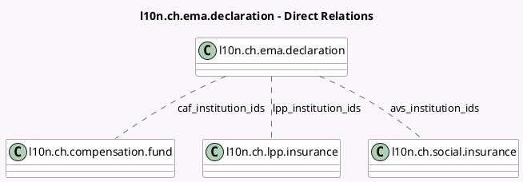

<!-- GENERATED:MODEL -->
---
tags: [odoo, enterprise, generated, model]
---

# l10n.ch.ema.declaration

- Module: [[docs/Enterprise Addons/l10n_ch_hr_payroll/l10n_ch_hr_payroll|l10n_ch_hr_payroll]]
- Scope: Enterprise Addons
- Defined in module: yes
- Source files: `models/l10n_ch_declaration_ema.py`
- Python classes: `L10nChEMADeclaration`
- Description: Entry / Withdrawal / Mutation Declaration for AVS / CAF / LPP
- Inherits: `l10n.ch.swissdec.transmitter`

## Field footprint

- Detected fields: 3
- Field types: `Many2many` x 3
- Relation fields: 3

## Sample fields

- `avs_institution_ids`: `Many2many` (comodel `l10n.ch.social.insurance`)
- `caf_institution_ids`: `Many2many` (comodel `l10n.ch.compensation.fund`)
- `lpp_institution_ids`: `Many2many` (comodel `l10n.ch.lpp.insurance`)

## Method hints

- Detected methods: 3
- Action methods: `action_prepare_data`
- Compute methods: none
- Onchange methods: none

## Direct relation diagram

## Navigation

- **Parent:** [[docs/Enterprise Addons/l10n_ch_hr_payroll/Models]]

<!-- GENERATED:MODEL -->
