<!-- GENERATED:MODEL -->
---
tags: [odoo, enterprise, generated, model]
---

# l10n.ch.hr.contract.wage

- Module: [[docs/Enterprise Addons/l10n_ch_hr_payroll/l10n_ch_hr_payroll|l10n_ch_hr_payroll]]
- Scope: Enterprise Addons
- Defined in module: yes
- Source files: `models/l10n_ch_hr_contract_wage.py`
- Python classes: `L10nChHrContractWage`
- Description: Monthly Recurring Wages

## Field footprint

- Detected fields: 9
- Field types: `Char` x 1, `Date` x 1, `Float` x 1, `Many2one` x 4, `Selection` x 2
- Relation fields: 4

## Sample fields

- `amount`: `Float`
- `currency_id`: `Many2one` (related `version_id.currency_id`)
- `date_start`: `Date`
- `description`: `Char`
- `employee_id`: `Many2one` (related `version_id.employee_id`, store `True`)
- `input_type_id`: `Many2one` (comodel `hr.payslip.input.type`)
- `type`: `Selection` (compute `_compute_type`, store `True`)
- `uom`: `Selection` (compute `_compute_uom`, store `True`)
- `version_id`: `Many2one` (comodel `hr.version`)

## Method hints

- Detected methods: 3
- Action methods: none
- Compute methods: `_compute_display_name`, `_compute_type`, `_compute_uom`
- Onchange methods: none

## Direct relation diagram

```plantuml
@startuml
!define ODOO_COLOR_PRIMARY #714B67
!define ODOO_COLOR_ACCENT #875A7B
!define ODOO_COLOR_BG #FAF7FA

skinparam backgroundColor ODOO_COLOR_BG
skinparam defaultTextAlignment left
skinparam ArrowColor ODOO_COLOR_ACCENT
skinparam ClassBackgroundColor white
skinparam ClassBorderColor ODOO_COLOR_PRIMARY
skinparam ComponentBackgroundColor white
skinparam ComponentBorderColor ODOO_COLOR_PRIMARY
skinparam NoteBackgroundColor #FFF8FF
skinparam NoteBorderColor ODOO_COLOR_ACCENT
skinparam SequenceLifeLineBorderColor ODOO_COLOR_ACCENT
skinparam SequenceLifeLineBackgroundColor #FFFFFF
skinparam SequenceParticipantBorderColor ODOO_COLOR_PRIMARY
skinparam SequenceParticipantBackgroundColor #FFFFFF
skinparam sequence {
  ArrowColor ODOO_COLOR_ACCENT
  ActorBorderColor ODOO_COLOR_PRIMARY
}
title l10n.ch.hr.contract.wage - Direct Relations
class "l10n.ch.hr.contract.wage" as l10n_ch_hr_contract_wage
class "hr.payslip.input.type" as hr_payslip_input_type
class "hr.version" as hr_version
l10n_ch_hr_contract_wage --> hr_version : version_id
l10n_ch_hr_contract_wage --> hr_payslip_input_type : input_type_id
@enduml
```

## Navigation

- **Parent:** [[docs/Enterprise Addons/l10n_ch_hr_payroll/Models]]

<!-- GENERATED:MODEL -->
