<!-- GENERATED:MODEL -->
---
tags: [odoo, enterprise, generated, model]
---

# l10n.ch.lpp.insurance

- Module: [[docs/Enterprise Addons/l10n_ch_hr_payroll/l10n_ch_hr_payroll|l10n_ch_hr_payroll]]
- Scope: Enterprise Addons
- Defined in module: yes
- Source files: `models/l10n_ch_lpp.py`
- Python classes: `L10nChLppInsurance`
- Description: Swiss: LPP Insurances

## Field footprint

- Detected fields: 9
- Field types: `Boolean` x 1, `Char` x 6, `Many2one` x 1, `One2many` x 1
- Relation fields: 2

## Sample fields

- `active`: `Boolean`
- `company_id`: `Many2one` (comodel `res.company`)
- `contract_number`: `Char`
- `customer_number`: `Char`
- `fund_number`: `Char`
- `insurance_code`: `Char`
- `name`: `Char`
- `solutions_ids`: `One2many` (comodel `l10n.ch.lpp.insurance.line`)
- `uid_bfs`: `Char`

## Method hints

- Detected methods: 1
- Action methods: none
- Compute methods: none
- Onchange methods: none

## Direct relation diagram

```plantuml
@startuml
!define ODOO_COLOR_PRIMARY #714B67
!define ODOO_COLOR_ACCENT #875A7B
!define ODOO_COLOR_BG #FAF7FA

skinparam backgroundColor ODOO_COLOR_BG
skinparam defaultTextAlignment left
skinparam ArrowColor ODOO_COLOR_ACCENT
skinparam ClassBackgroundColor white
skinparam ClassBorderColor ODOO_COLOR_PRIMARY
skinparam ComponentBackgroundColor white
skinparam ComponentBorderColor ODOO_COLOR_PRIMARY
skinparam NoteBackgroundColor #FFF8FF
skinparam NoteBorderColor ODOO_COLOR_ACCENT
skinparam SequenceLifeLineBorderColor ODOO_COLOR_ACCENT
skinparam SequenceLifeLineBackgroundColor #FFFFFF
skinparam SequenceParticipantBorderColor ODOO_COLOR_PRIMARY
skinparam SequenceParticipantBackgroundColor #FFFFFF
skinparam sequence {
  ArrowColor ODOO_COLOR_ACCENT
  ActorBorderColor ODOO_COLOR_PRIMARY
}
title l10n.ch.lpp.insurance - Direct Relations
class "l10n.ch.lpp.insurance" as l10n_ch_lpp_insurance
class "l10n.ch.lpp.insurance.line" as l10n_ch_lpp_insurance_line
class "res.company" as res_company
l10n_ch_lpp_insurance --> res_company : company_id
l10n_ch_lpp_insurance --|> l10n_ch_lpp_insurance_line : solutions_ids
@enduml
```

## Navigation

- **Parent:** [[docs/Enterprise Addons/l10n_ch_hr_payroll/Models]]

<!-- GENERATED:MODEL -->
