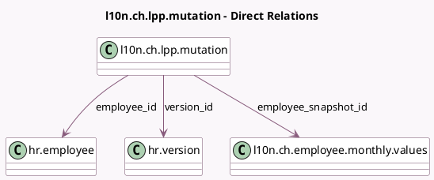

<!-- GENERATED:MODEL -->
---
tags: [odoo, enterprise, generated, model]
---

# l10n.ch.lpp.mutation

- Module: [[docs/Enterprise Addons/l10n_ch_hr_payroll/l10n_ch_hr_payroll|l10n_ch_hr_payroll]]
- Scope: Enterprise Addons
- Defined in module: yes
- Source files: `models/l10n_ch_ema_lpp.py`
- Python classes: `l10nCHLPPEMA`
- Description: BVG-LPP Mutations

## Field footprint

- Detected fields: 6
- Field types: `Boolean` x 1, `Date` x 1, `Many2one` x 3, `Selection` x 1
- Relation fields: 3

## Sample fields

- `auto_generated`: `Boolean`
- `employee_id`: `Many2one` (comodel `hr.employee`)
- `employee_snapshot_id`: `Many2one` (comodel `l10n.ch.employee.monthly.values`)
- `reason`: `Selection`
- `valid_as_of`: `Date`
- `version_id`: `Many2one` (comodel `hr.version`)

## Method hints

- Detected methods: 0
- Action methods: none
- Compute methods: none
- Onchange methods: none

## Direct relation diagram

## Navigation

- **Parent:** [[docs/Enterprise Addons/l10n_ch_hr_payroll/Models]]

<!-- GENERATED:MODEL -->
