<!-- GENERATED:MODEL -->
---
tags: [odoo, enterprise, generated, model]
---

# l10n.ch.monthly.summary

- Module: [[docs/Enterprise Addons/l10n_ch_hr_payroll/l10n_ch_hr_payroll|l10n_ch_hr_payroll]]
- Scope: Enterprise Addons
- Defined in module: yes
- Source files: `models/l10n_ch_monthly_summary.py`
- Python classes: `L10nChMonthlySummary`
- Description: Swiss Payroll: Monthly Summary

## Field footprint

- Detected fields: 11
- Field types: `Binary` x 2, `Char` x 2, `Date` x 2, `Integer` x 1, `Many2many` x 1, `Many2one` x 1, `Selection` x 2
- Relation fields: 2

## Sample fields

- `aggregation_type`: `Selection`
- `company_ids`: `Many2many` (comodel `res.company`)
- `currency_id`: `Many2one` (comodel `res.currency`, related `company_ids.currency_id`)
- `date_end`: `Date` (comodel `End Period`, compute `_compute_dates`, store `True`)
- `date_start`: `Date` (comodel `Start Period`, compute `_compute_dates`, store `True`)
- `month`: `Selection`
- `monthly_summary_pdf_file`: `Binary` (comodel `Monthly Summary PDF`)
- `monthly_summary_pdf_filename`: `Char`
- `monthly_summary_xls_file`: `Binary` (comodel `Monthly Summary XLS`)
- `monthly_summary_xls_filename`: `Char`
- `year`: `Integer`

## Method hints

- Detected methods: 7
- Action methods: `action_generate_pdf`, `action_generate_xls`
- Compute methods: `_compute_dates`, `_compute_display_name`
- Onchange methods: none

## Direct relation diagram

```plantuml
@startuml
!define ODOO_COLOR_PRIMARY #714B67
!define ODOO_COLOR_ACCENT #875A7B
!define ODOO_COLOR_BG #FAF7FA

skinparam backgroundColor ODOO_COLOR_BG
skinparam defaultTextAlignment left
skinparam ArrowColor ODOO_COLOR_ACCENT
skinparam ClassBackgroundColor white
skinparam ClassBorderColor ODOO_COLOR_PRIMARY
skinparam ComponentBackgroundColor white
skinparam ComponentBorderColor ODOO_COLOR_PRIMARY
skinparam NoteBackgroundColor #FFF8FF
skinparam NoteBorderColor ODOO_COLOR_ACCENT
skinparam SequenceLifeLineBorderColor ODOO_COLOR_ACCENT
skinparam SequenceLifeLineBackgroundColor #FFFFFF
skinparam SequenceParticipantBorderColor ODOO_COLOR_PRIMARY
skinparam SequenceParticipantBackgroundColor #FFFFFF
skinparam sequence {
  ArrowColor ODOO_COLOR_ACCENT
  ActorBorderColor ODOO_COLOR_PRIMARY
}
title l10n.ch.monthly.summary - Direct Relations
class "l10n.ch.monthly.summary" as l10n_ch_monthly_summary
class "res.company" as res_company
class "res.currency" as res_currency
l10n_ch_monthly_summary .. res_company : company_ids
l10n_ch_monthly_summary --> res_currency : currency_id
@enduml
```

## Navigation

- **Parent:** [[docs/Enterprise Addons/l10n_ch_hr_payroll/Models]]

<!-- GENERATED:MODEL -->
