<!-- GENERATED:MODEL -->
---
tags: [odoo, enterprise, generated, model]
---

# l10n.ch.salary.certificate

- Module: [[docs/Enterprise Addons/l10n_ch_hr_payroll/l10n_ch_hr_payroll|l10n_ch_hr_payroll]]
- Scope: Enterprise Addons
- Defined in module: yes
- Source files: `models/l10n_ch_declaration_salary_certificate.py`
- Python classes: `L10nChSalaryCertificate`
- Description: Tax Salaries Rectification
- Inherits: `l10n.ch.swissdec.transmitter`

## Field footprint

- Detected fields: 5
- Field types: `Date` x 1, `Integer` x 1, `Many2many` x 1, `Many2one` x 1, `Selection` x 1
- Relation fields: 2

## Sample fields

- `original_date`: `Date`
- `previous_declaration`: `Many2one` (comodel `ch.yearly.report`)
- `tax_rectificate_employee_ids`: `Many2many` (comodel `hr.employee`)
- `tax_rectificate_type`: `Selection`
- `wage_statement_count`: `Integer` (compute `_compute_wage_statement_count`)

## Method hints

- Detected methods: 7
- Action methods: `action_open_wage_statements`, `action_prepare_data`
- Compute methods: `_compute_wage_statement_count`
- Onchange methods: none

## Direct relation diagram

```plantuml
@startuml
!define ODOO_COLOR_PRIMARY #714B67
!define ODOO_COLOR_ACCENT #875A7B
!define ODOO_COLOR_BG #FAF7FA

skinparam backgroundColor ODOO_COLOR_BG
skinparam defaultTextAlignment left
skinparam ArrowColor ODOO_COLOR_ACCENT
skinparam ClassBackgroundColor white
skinparam ClassBorderColor ODOO_COLOR_PRIMARY
skinparam ComponentBackgroundColor white
skinparam ComponentBorderColor ODOO_COLOR_PRIMARY
skinparam NoteBackgroundColor #FFF8FF
skinparam NoteBorderColor ODOO_COLOR_ACCENT
skinparam SequenceLifeLineBorderColor ODOO_COLOR_ACCENT
skinparam SequenceLifeLineBackgroundColor #FFFFFF
skinparam SequenceParticipantBorderColor ODOO_COLOR_PRIMARY
skinparam SequenceParticipantBackgroundColor #FFFFFF
skinparam sequence {
  ArrowColor ODOO_COLOR_ACCENT
  ActorBorderColor ODOO_COLOR_PRIMARY
}
title l10n.ch.salary.certificate - Direct Relations
class "l10n.ch.salary.certificate" as l10n_ch_salary_certificate
class "ch.yearly.report" as ch_yearly_report
class "hr.employee" as hr_employee
l10n_ch_salary_certificate --> ch_yearly_report : previous_declaration
l10n_ch_salary_certificate .. hr_employee : tax_rectificate_employee_ids
@enduml
```

## Navigation

- **Parent:** [[docs/Enterprise Addons/l10n_ch_hr_payroll/Models]]

<!-- GENERATED:MODEL -->
