<!-- GENERATED:MODEL -->
---
tags: [odoo, enterprise, generated, model]
---

# l10n.ch.salary.certificate.profile

- Module: [[docs/Enterprise Addons/l10n_ch_hr_payroll/l10n_ch_hr_payroll|l10n_ch_hr_payroll]]
- Scope: Enterprise Addons
- Defined in module: yes
- Source files: `models/l10n_ch_salary_certificate_profile.py`
- Python classes: `L10nChsalaryCertificateProfile`
- Description: Salary Certificate Profile

## Field footprint

- Detected fields: 36
- Field types: `Boolean` x 12, `Char` x 9, `Date` x 4, `Float` x 1, `Many2one` x 4, `Selection` x 6
- Relation fields: 4

## Sample fields

- `certificate_template_id`: `Many2one` (comodel `l10n.ch.salary.certificate.profile`)
- `company_id`: `Many2one` (comodel `res.company`)
- `employee_id`: `Many2one` (comodel `hr.employee`)
- `l10n_ch_certificate_type`: `Selection`
- `l10n_ch_child_allowance_indirect`: `Boolean`
- `l10n_ch_cs_additional_text`: `Char` (compute `_compute_certificate_values`, store `True`)
- `l10n_ch_cs_car_policy`: `Selection` (compute `_compute_certificate_values`, store `True`)
- `l10n_ch_cs_employee_parti_fair_market_value`: `Boolean` (compute `_compute_certificate_values`, store `True`)
- `l10n_ch_cs_employee_parti_fair_market_value_canton`: `Selection` (compute `_compute_certificate_values`, store `True`)
- `l10n_ch_cs_employee_parti_fair_market_value_date`: `Date` (compute `_compute_certificate_values`, store `True`)
- `l10n_ch_cs_employee_participation_taxable_income`: `Boolean` (compute `_compute_certificate_values`, store `True`)
- `l10n_ch_cs_employee_participation_taxable_income_locked`: `Boolean` (compute `_compute_certificate_values`, store `True`)
- `l10n_ch_cs_employee_participation_taxable_income_reversional`: `Boolean` (compute `_compute_certificate_values`, store `True`)
- `l10n_ch_cs_employee_participation_taxable_income_unlisted`: `Boolean` (compute `_compute_certificate_values`, store `True`)
- `l10n_ch_cs_employee_participation_taxable_income_virtual`: `Boolean` (compute `_compute_certificate_values`, store `True`)
- `l10n_ch_cs_expense_expatriate_ruling_approved`: `Boolean` (compute `_compute_certificate_values`, store `True`)
- `l10n_ch_cs_expense_expatriate_ruling_approved_canton`: `Selection` (compute `_compute_certificate_values`, store `True`)
- `l10n_ch_cs_expense_expatriate_ruling_approved_date`: `Date` (compute `_compute_certificate_values`, store `True`)
- `l10n_ch_cs_expense_policy`: `Selection` (compute `_compute_certificate_values`, store `True`)
- `l10n_ch_cs_expense_policy_approved_canton`: `Selection` (compute `_compute_certificate_values`, store `True`)

## Method hints

- Detected methods: 3
- Action methods: `action_update_all_certificates`
- Compute methods: `_compute_certificate_values`
- Onchange methods: none

## Direct relation diagram

```plantuml
@startuml
!define ODOO_COLOR_PRIMARY #714B67
!define ODOO_COLOR_ACCENT #875A7B
!define ODOO_COLOR_BG #FAF7FA

skinparam backgroundColor ODOO_COLOR_BG
skinparam defaultTextAlignment left
skinparam ArrowColor ODOO_COLOR_ACCENT
skinparam ClassBackgroundColor white
skinparam ClassBorderColor ODOO_COLOR_PRIMARY
skinparam ComponentBackgroundColor white
skinparam ComponentBorderColor ODOO_COLOR_PRIMARY
skinparam NoteBackgroundColor #FFF8FF
skinparam NoteBorderColor ODOO_COLOR_ACCENT
skinparam SequenceLifeLineBorderColor ODOO_COLOR_ACCENT
skinparam SequenceLifeLineBackgroundColor #FFFFFF
skinparam SequenceParticipantBorderColor ODOO_COLOR_PRIMARY
skinparam SequenceParticipantBackgroundColor #FFFFFF
skinparam sequence {
  ArrowColor ODOO_COLOR_ACCENT
  ActorBorderColor ODOO_COLOR_PRIMARY
}
title l10n.ch.salary.certificate.profile - Direct Relations
class "l10n.ch.salary.certificate.profile" as l10n_ch_salary_certificate_profile
class "hr.employee" as hr_employee
class "l10n.ch.salary.certificate.profile" as l10n_ch_salary_certificate_profile
class "res.company" as res_company
class "res.country" as res_country
l10n_ch_salary_certificate_profile --> hr_employee : employee_id
l10n_ch_salary_certificate_profile --> l10n_ch_salary_certificate_profile : certificate_template_id
l10n_ch_salary_certificate_profile --> res_company : company_id
l10n_ch_salary_certificate_profile --> res_country : l10n_ch_provision_salary_country
@enduml
```

## Navigation

- **Parent:** [[docs/Enterprise Addons/l10n_ch_hr_payroll/Models]]

<!-- GENERATED:MODEL -->
