<!-- GENERATED:MODEL -->
---
tags: [odoo, enterprise, generated, model]
---

# l10n.ch.sickness.insurance.line

- Module: [[docs/Enterprise Addons/l10n_ch_hr_payroll/l10n_ch_hr_payroll|l10n_ch_hr_payroll]]
- Scope: Enterprise Addons
- Defined in module: yes
- Source files: `models/l10n_ch_ijm.py`
- Python classes: `L10nChSicknessInsuranceLine`
- Description: Swiss: Sickness Insurances Line (IJM)

## Field footprint

- Detected fields: 6
- Field types: `Char` x 2, `Many2one` x 1, `One2many` x 1, `Selection` x 2
- Relation fields: 2

## Sample fields

- `insurance_id`: `Many2one` (comodel `l10n.ch.sickness.insurance`)
- `rate_ids`: `One2many` (comodel `l10n.ch.sickness.insurance.line.rate`)
- `solution_code`: `Char` (compute `_compute_solution_code`)
- `solution_name`: `Char`
- `solution_number`: `Selection`
- `solution_type`: `Selection`

## Method hints

- Detected methods: 3
- Action methods: none
- Compute methods: `_compute_solution_code`
- Onchange methods: none

## Direct relation diagram

```plantuml
@startuml
!define ODOO_COLOR_PRIMARY #714B67
!define ODOO_COLOR_ACCENT #875A7B
!define ODOO_COLOR_BG #FAF7FA

skinparam backgroundColor ODOO_COLOR_BG
skinparam defaultTextAlignment left
skinparam ArrowColor ODOO_COLOR_ACCENT
skinparam ClassBackgroundColor white
skinparam ClassBorderColor ODOO_COLOR_PRIMARY
skinparam ComponentBackgroundColor white
skinparam ComponentBorderColor ODOO_COLOR_PRIMARY
skinparam NoteBackgroundColor #FFF8FF
skinparam NoteBorderColor ODOO_COLOR_ACCENT
skinparam SequenceLifeLineBorderColor ODOO_COLOR_ACCENT
skinparam SequenceLifeLineBackgroundColor #FFFFFF
skinparam SequenceParticipantBorderColor ODOO_COLOR_PRIMARY
skinparam SequenceParticipantBackgroundColor #FFFFFF
skinparam sequence {
  ArrowColor ODOO_COLOR_ACCENT
  ActorBorderColor ODOO_COLOR_PRIMARY
}
title l10n.ch.sickness.insurance.line - Direct Relations
class "l10n.ch.sickness.insurance.line" as l10n_ch_sickness_insurance_line
class "l10n.ch.sickness.insurance" as l10n_ch_sickness_insurance
class "l10n.ch.sickness.insurance.line.rate" as l10n_ch_sickness_insurance_line_rate
l10n_ch_sickness_insurance_line --> l10n_ch_sickness_insurance : insurance_id
l10n_ch_sickness_insurance_line --|> l10n_ch_sickness_insurance_line_rate : rate_ids
@enduml
```

## Navigation

- **Parent:** [[docs/Enterprise Addons/l10n_ch_hr_payroll/Models]]

<!-- GENERATED:MODEL -->
