<!-- GENERATED:MODEL -->
---
tags: [odoo, enterprise, generated, model]
---

# l10n.ch.social.insurance.avs.retirement.rente

- Module: [[docs/Enterprise Addons/l10n_ch_hr_payroll/l10n_ch_hr_payroll|l10n_ch_hr_payroll]]
- Scope: Enterprise Addons
- Defined in module: yes
- Source files: `models/l10n_avs.py`
- Python classes: `L10nChSocialInsuranceAvsRetirementRente`
- Description: Swiss: Retired Employees Exoneration

## Field footprint

- Detected fields: 4
- Field types: `Date` x 2, `Float` x 1, `Many2one` x 1
- Relation fields: 1

## Sample fields

- `amount`: `Float`
- `date_from`: `Date`
- `date_to`: `Date`
- `insurance_id`: `Many2one` (comodel `l10n.ch.social.insurance`)

## Method hints

- Detected methods: 0
- Action methods: none
- Compute methods: none
- Onchange methods: none

## Direct relation diagram

```plantuml
@startuml
!define ODOO_COLOR_PRIMARY #714B67
!define ODOO_COLOR_ACCENT #875A7B
!define ODOO_COLOR_BG #FAF7FA

skinparam backgroundColor ODOO_COLOR_BG
skinparam defaultTextAlignment left
skinparam ArrowColor ODOO_COLOR_ACCENT
skinparam ClassBackgroundColor white
skinparam ClassBorderColor ODOO_COLOR_PRIMARY
skinparam ComponentBackgroundColor white
skinparam ComponentBorderColor ODOO_COLOR_PRIMARY
skinparam NoteBackgroundColor #FFF8FF
skinparam NoteBorderColor ODOO_COLOR_ACCENT
skinparam SequenceLifeLineBorderColor ODOO_COLOR_ACCENT
skinparam SequenceLifeLineBackgroundColor #FFFFFF
skinparam SequenceParticipantBorderColor ODOO_COLOR_PRIMARY
skinparam SequenceParticipantBackgroundColor #FFFFFF
skinparam sequence {
  ArrowColor ODOO_COLOR_ACCENT
  ActorBorderColor ODOO_COLOR_PRIMARY
}
title l10n.ch.social.insurance.avs.retirement.rente - Direct Relations
class "l10n.ch.social.insurance.avs.retirement.rente" as l10n_ch_social_insurance_avs_retirement_rente
class "l10n.ch.social.insurance" as l10n_ch_social_insurance
l10n_ch_social_insurance_avs_retirement_rente --> l10n_ch_social_insurance : insurance_id
@enduml
```

## Navigation

- **Parent:** [[docs/Enterprise Addons/l10n_ch_hr_payroll/Models]]

<!-- GENERATED:MODEL -->
